# 🚌 ChannelMediator.AzureBus

**Distributed messaging extension for ChannelMediator using Azure Service Bus.**

## Table of Contents

- [Why Distributed Messaging?](#-why-distributed-messaging)
- [How It Works](#-how-it-works)
- [Installation](#-installation)
- [Configuration](#-configuration)
  - [Live Mode](#live-mode-azure-service-bus)
  - [Mock Mode](#mock-mode-local-development)
- [Publishing Notifications (Topics)](#-publishing-notifications-topics)
- [Enqueuing Requests (Queues)](#-enqueuing-requests-queues)
- [Reading Notifications (Topic Subscriptions)](#-reading-notifications-topic-subscriptions)
- [Reading Requests (Queue Consumers)](#-reading-requests-queue-consumers)
- [Scaling with Competing Consumers](#-scaling-with-competing-consumers)
- [Entity Auto-Creation](#-entity-auto-creation)
- [Fire-and-Forget Semantics](#-fire-and-forget-semantics)
- [Full Architecture](#-full-architecture)
- [Configuration Reference](#-configuration-reference)
- [End-to-End Example](#-end-to-end-example)

---

## 🌐 Why Distributed Messaging?

In a monolithic application, a mediator dispatches requests and notifications in-process — the producer and consumer live in the same deployment. This works well, but it breaks down when you need to **scale independently**, **distribute workloads**, or **decouple services**.

### The Microservice Challenge

In a microservice environment, services must communicate across process boundaries. A single instance handling all requests quickly becomes a bottleneck:

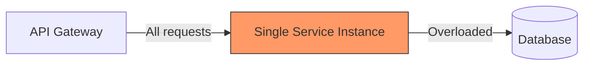

What you actually need is the ability to **distribute work across multiple consumers** so that each service instance processes a subset of the load:

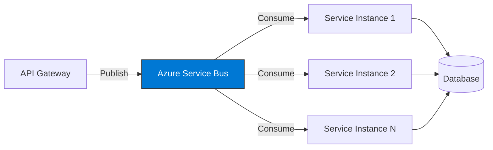

### Key Benefits

| Benefit | Description |
|---------|-------------|
| **Horizontal Scaling** | Add more consumer instances to handle increased load |
| **Decoupling** | Producers and consumers are independent — deploy, scale, and fail separately |
| **Resilience** | Messages are persisted in the bus — if a consumer crashes, the message is not lost |
| **Backpressure** | The bus absorbs traffic spikes; consumers process at their own pace |
| **Event-Driven** | Notifications fan out to multiple subscribers without the publisher knowing about them |

### ChannelMediator.AzureBus bridges the gap

`ChannelMediator.AzureBus` extends the familiar `IMediator` API with two extension methods — `Notify` and `EnqueueRequest` — that transparently route messages through **Azure Service Bus** instead of in-process channels:

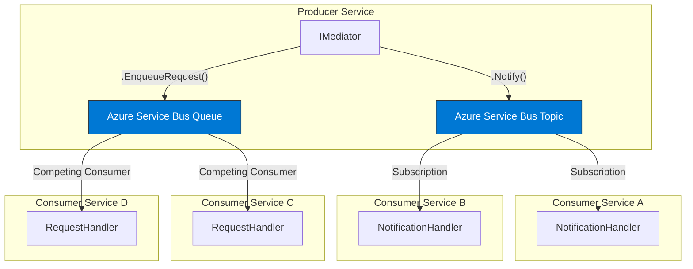

- **Topics** → Fan-out delivery: every subscriber receives a copy (notifications)
- **Queues** → Competing consumers: only one consumer processes each message (requests/commands)

---

## ⚙️ How It Works

### Message Flow Overview

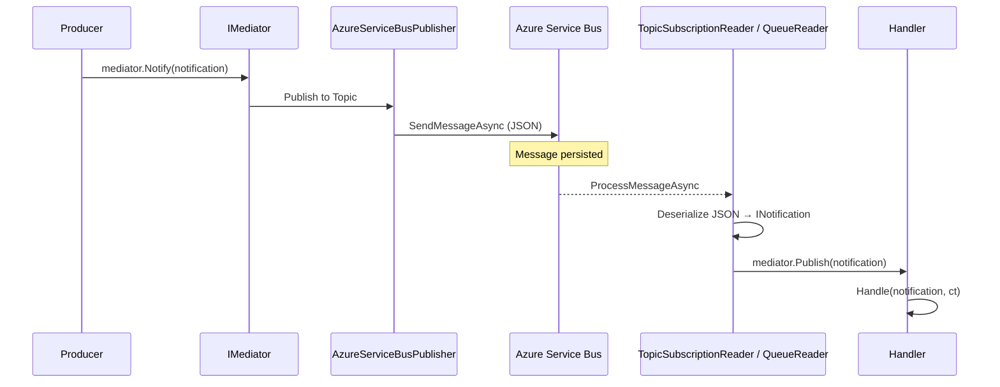

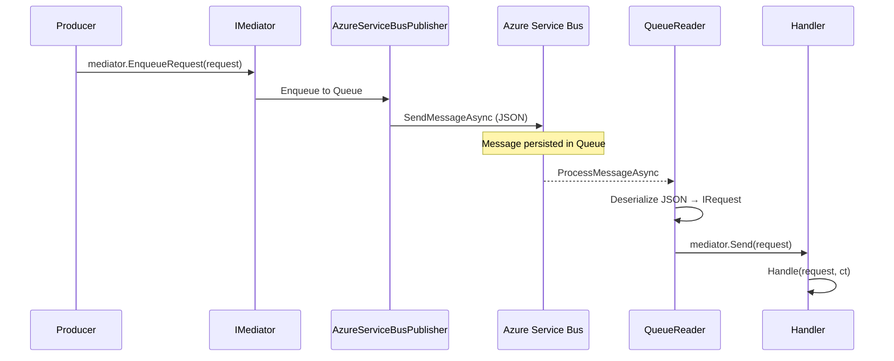

### Naming Convention

All queue and topic names are automatically built using the configured prefix and the type name:

```
{prefix}{typeName}
```

For example, with `Prefix = "myapp"`:
- `ProductAddedNotification` → topic: `myapp-productaddednotification`
- `MyRequest` → queue: `myapp-myrequest`

Names are lowercased and normalized (double dots removed, trimmed).

---

## 📦 Installation

```bash
# Project reference (local)
dotnet add reference ../ChannelMediator.AzureBus/ChannelMediator.AzureBus.csproj
```

**Dependencies:**
- `ChannelMediator`
- `Azure.Messaging.ServiceBus`

---

## 🔧 Configuration

### Live Mode (Azure Service Bus)

```csharp
using ChannelMediator;
using ChannelMediator.AzureBus;

var host = Host.CreateDefaultBuilder(args)
    .ConfigureServices((context, services) =>
    {
        var connectionString = context.Configuration.GetConnectionString("AzureBusConnectionString");

        services.AddChannelMediator(config =>
        {
            config.Strategy = NotificationPublishStrategy.Parallel;

            config.UseChannelMediatorAzureBus(opts =>
            {
                opts.Prefix = "myapp";
                opts.ConnectionString = connectionString!;
                opts.ProcessMode = AzureServiceBusMode.Live;
                opts.TopicSubscriberName = "order-service";
            });

        }, Assembly.GetExecutingAssembly());
    })
    .Build();
```

### Mock Mode (Local Development)

In mock mode, no Azure Service Bus connection is needed. Messages are processed **in-process** through the local mediator, making it ideal for development and testing:

```csharp
config.UseChannelMediatorAzureBus(opts =>
{
    opts.Prefix = "myapp";
    opts.ProcessMode = AzureServiceBusMode.Mock;
});
```

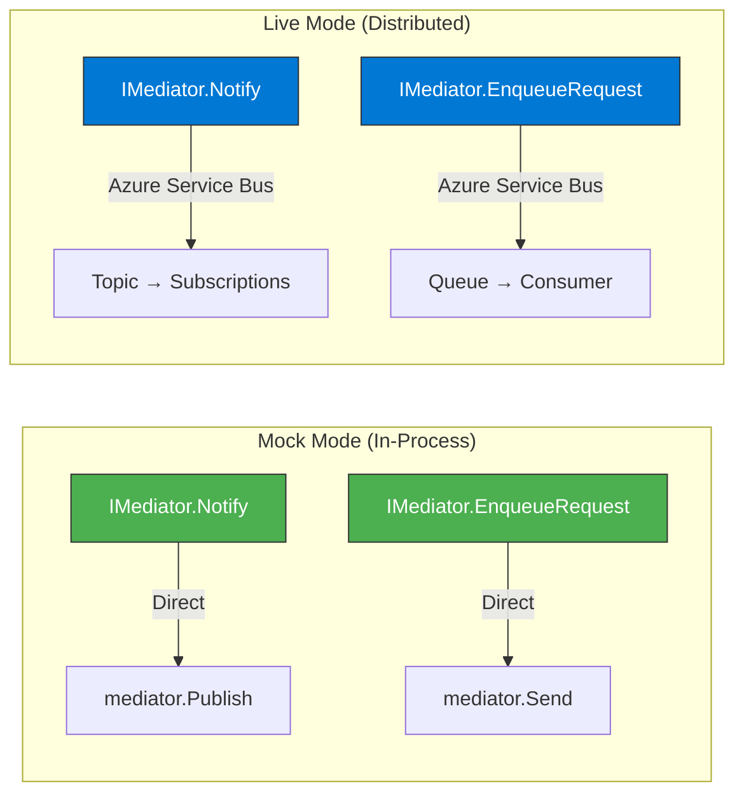

> **Tip:** Use `AzureServiceBusMode.Mock` in your `appsettings.Development.json` configuration to keep local development simple and fast.

---

## 📢 Publishing Notifications (Topics)

Notifications use the **publish-subscribe** pattern via Azure Service Bus **Topics**. Every registered subscriber receives a copy of the message.

### 1. Define a shared notification

```csharp
// In a shared library referenced by both producer and consumer
public record ProductAddedNotification(string ProductCode, int Quantity, decimal Total)
    : INotification;
```

### 2. Publish from the producer

```csharp
var mediator = app.Services.GetRequiredService<IMediator>();

// Sends to Azure Service Bus topic "myapp-productaddednotification"
await mediator.Notify(new ProductAddedNotification("SKU-001", 5, 49.95m));
```

### 3. Subscribe from the consumer

```csharp
config.UseChannelMediatorAzureBus(opts =>
{
    opts.Prefix = "myapp";
    opts.ConnectionString = connectionString!;
    opts.TopicSubscriberName = "inventory-service";

    // Register a reader for this notification type
    opts.AddAzureBusTopicNotificationReader<ProductAddedNotification>("inventory-service");
});
```

### 4. Handle the notification

```csharp
public sealed class UpdateInventoryHandler : INotificationHandler<ProductAddedNotification>
{
    public async Task Handle(ProductAddedNotification notification, CancellationToken cancellationToken)
    {
        Console.WriteLine($"[INVENTORY] Updating stock for product: {notification.ProductCode}");
        // Business logic...
    }
}
```

### Topic Flow Diagram

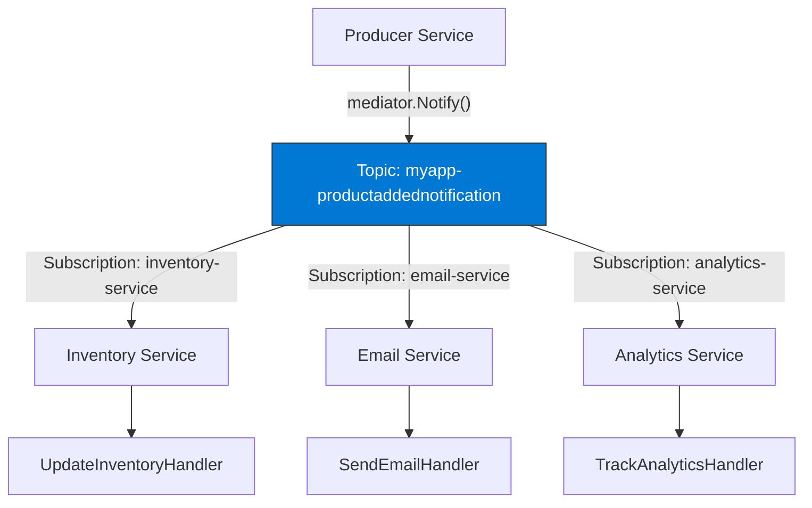

---

## 📨 Enqueuing Requests (Queues)

Requests use the **competing consumers** pattern via Azure Service Bus **Queues**. Only **one consumer** processes each message, enabling horizontal scaling.

### 1. Define a shared request

```csharp
// In a shared library
public record MyRequest(string Message) : IRequest;
```

### 2. Enqueue from the producer

```csharp
// Sends to Azure Service Bus queue "myapp-myrequest"
await mediator.EnqueueRequest(new MyRequest("process-order-42"));
```

### 3. Register a queue reader on the consumer

```csharp
config.UseChannelMediatorAzureBus(opts =>
{
    opts.Prefix = "myapp";
    opts.ConnectionString = connectionString!;

    // Register a reader for this request type
    opts.AddAzureQueueRequestReader<MyRequest>();
});
```

### 4. Handle the request

```csharp
internal class MyRequestHandler : IRequestHandler<MyRequest>
{
    public Task Handle(MyRequest request, CancellationToken cancellationToken)
    {
        Console.WriteLine($"Processing: {request.Message}");
        return Task.CompletedTask;
    }
}
```

### Queue Flow Diagram

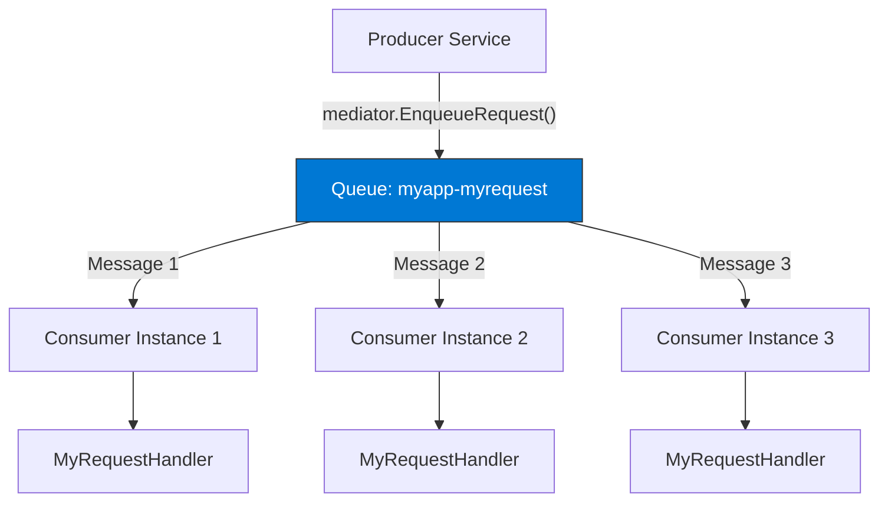

---

## 📖 Reading Notifications (Topic Subscriptions)

### Per-Type Registration

Register a reader for a specific notification type:

```csharp
opts.AddAzureBusTopicNotificationReader<ProductAddedNotification>("my-subscriber-name");
```

### Subscribe to All Topics

Automatically subscribe to all topics that match the configured prefix:

```csharp
opts.AddAllAzureBusTopicNotification();
```

At startup, the `TopicSubscriptionReadersHostedService` enumerates all existing topics in the Azure Service Bus namespace, filters those starting with `opts.Prefix`, and creates a subscription reader for each one using `opts.TopicSubscriberName`. Handlers are resolved dynamically by deserializing the `AssemblyQualifiedName` from the message's `ApplicationProperties`.

> **Note:** `AddAllAzureBusTopicNotification()` requires both `TopicSubscriberName` and `Prefix` to be set. If either is empty, the call is silently ignored.

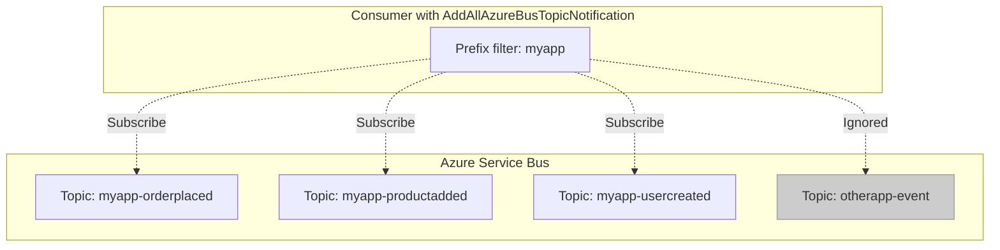

---

## 📖 Reading Requests (Queue Consumers)

### Typed Queue Reader

Reads from a queue and dispatches the deserialized request through `mediator.Send(...)`:

```csharp
opts.AddAzureQueueRequestReader<MyRequest>();
```

The queue name is derived automatically from the type name and prefix.

---

## 📈 Scaling with Competing Consumers

The competing consumers pattern is the primary mechanism for horizontal scaling with queues. Each message is delivered to **exactly one** consumer instance.

### Single Instance vs. Multiple Instances

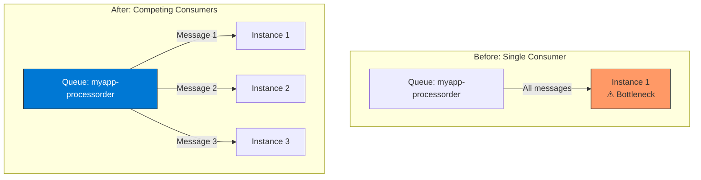

### How to Scale

Simply deploy more instances of the consumer service. Each instance registers the same queue reader:

```csharp
// Same configuration on every instance
opts.AddAzureQueueRequestReader<ProcessOrderRequest>();
```

Azure Service Bus automatically distributes messages across connected consumers using the **competing consumers** pattern. No code changes required — just add more instances.

### Concurrency Tuning

Control how many messages each instance processes concurrently:

```csharp
opts.AddAzureQueueRequestReader<ProcessOrderRequest>(configure: readerOpts =>
{
    readerOpts.MaxConcurrentCalls = 10;        // Process up to 10 messages concurrently
    readerOpts.AutoCompleteMessages = true;
    readerOpts.MaxAutoLockRenewalDuration = TimeSpan.FromMinutes(10);
});
```

Or set defaults at the global level:

```csharp
config.UseChannelMediatorAzureBus(opts =>
{
    opts.MaxConcurrentCalls = 5;
    opts.AutoCompleteMessages = true;
    opts.MaxAutoLockRenewalDuration = TimeSpan.FromMinutes(5);
});
```

---

## 🏗️ Entity Auto-Creation

`ChannelMediator.AzureBus` automatically creates Azure Service Bus entities (topics, queues, and subscriptions) on first use if they do not already exist.

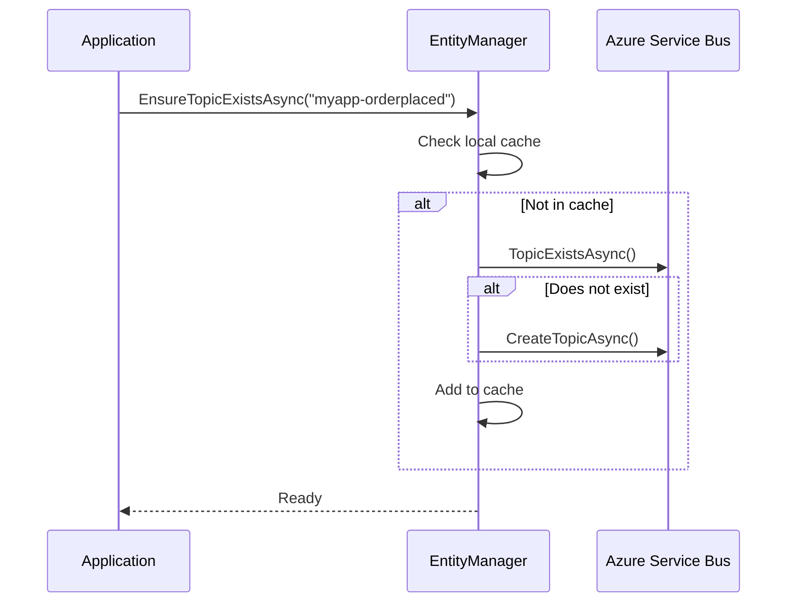

**Default entity settings:**
- `DefaultMessageTimeToLive`: 1 day
- `AutoDeleteOnIdle`: 1 day
- `EnableBatchedOperations`: true

---

## 🔥 Fire-and-Forget Semantics

In **Live mode**, the `Notify` and `EnqueueRequest` extension methods use fire-and-forget semantics. The message is dispatched to Azure Service Bus via `Task.Run(...)` and the method returns immediately without awaiting the result. This maximizes throughput on the producer side.

In **Mock mode**, the methods execute synchronously through the local mediator (awaited) for predictable behavior during development and testing.

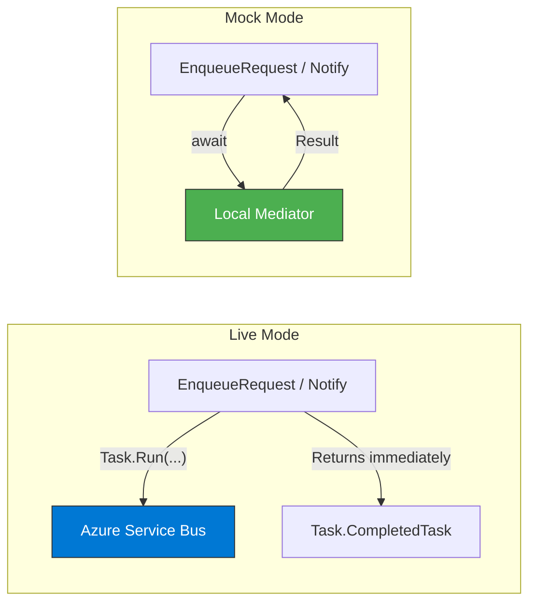

---

## 🏛️ Full Architecture

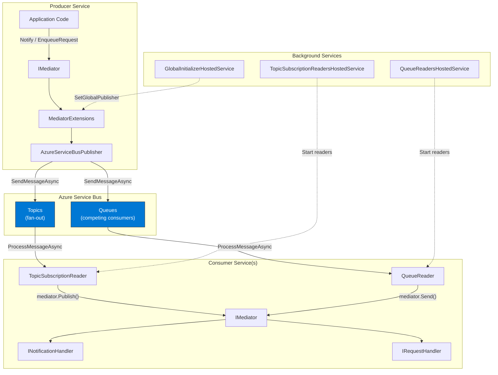

---

## 📋 Configuration Reference

### `AzureServiceBusOptions`

| Property | Type | Default | Description |
|----------|------|---------|-------------|
| `ConnectionString` | `string` | `""` | Azure Service Bus connection string |
| `Prefix` | `string` | — | Prefix for all queue and topic names |
| `ProcessMode` | `AzureServiceBusMode` | `Live` | `Live` for Azure Service Bus, `Mock` for in-process |
| `TopicSubscriberName` | `string` | Machine name | Default subscription name for topic readers |
| `MaxConcurrentCalls` | `int` | `1` | Default max concurrent calls per reader |
| `AutoCompleteMessages` | `bool` | `true` | Auto-complete messages after processing |
| `MaxAutoLockRenewalDuration` | `TimeSpan` | 5 minutes | Max duration for automatic lock renewal |
| `Strategy` | `NotificationPublishStrategy` | `Sequential` | Notification dispatch strategy (`Sequential` / `Parallel`) |

### Registration Methods

| Method | Description |
|--------|-------------|
| `AddAzureBusTopicNotificationReader<T>(subscriptionName)` | Register a reader for a specific notification topic |
| `AddAllAzureBusTopicNotification()` | Subscribe to all topics matching the prefix |
| `AddAzureQueueRequestReader<T>(queueName?, configure?)` | Register a reader for a specific request queue |

### Extension Methods on `IMediator`

| Method | Description |
|--------|-------------|
| `mediator.Notify<T>(notification, ct)` | Publish a notification to an Azure Service Bus topic |
| `mediator.EnqueueRequest<R>(request, ct)` | Enqueue a request to an Azure Service Bus queue |

---

## 🧪 End-to-End Example

### Shared Library

```csharp
// ChannelMediatorSampleShared

public record ProductAddedNotification(string ProductCode, int Quantity, decimal Total)
    : INotification;

public record MyRequest(string Message) : IRequest;
```

### Producer (Writer Console)

```csharp
var host = Host.CreateDefaultBuilder(args);

host.ConfigureServices((context, services) =>
{
    var connectionString = context.Configuration["ConnectionStrings:AzureBusConnectionString"];

    services.AddChannelMediator(config =>
    {
        config.Strategy = NotificationPublishStrategy.Parallel;

        config.UseChannelMediatorAzureBus(opts =>
        {
            opts.Prefix = "sampleapp";
            opts.ConnectionString = connectionString!;
            opts.TopicSubscriberName = "my-subscriber-name";
        });

    }, Assembly.GetExecutingAssembly());
});

var app = host.Build();

await app.StartAsync();

var mediator = app.Services.GetRequiredService<IMediator>();

// Enqueue a request (delivered to exactly one consumer)
await mediator.EnqueueRequest(new MyRequest("enqueue-test"));

// Publish a notification (delivered to all subscribers)
await mediator.Notify(new ProductAddedNotification("p01", 10, 100));
```

### Consumer (Reader Console)

```csharp
var host = Host.CreateDefaultBuilder(args)
    .ConfigureServices((context, services) =>
    {
        var connectionString = context.Configuration.GetConnectionString("AzureBusConnectionString");

        services.AddChannelMediator(config =>
        {
            config.Strategy = NotificationPublishStrategy.Parallel;

            config.UseChannelMediatorAzureBus(opts =>
            {
                opts.Prefix = "sampleapp";
                opts.ConnectionString = connectionString!;
                opts.TopicSubscriberName = "my-subscriber-name";

                // Read from request queue (competing consumers)
                opts.AddAzureQueueRequestReader<MyRequest>();

                // Subscribe to ALL topics matching the prefix (fan-out)
                opts.AddAllAzureBusTopicNotification();
            });

        }, Assembly.GetExecutingAssembly());
    })
    .Build();

await host.RunAsync();
```

### Handlers

```csharp
// Notification handler — receives copies of the notification
public sealed class UpdateInventoryHandler : INotificationHandler<ProductAddedNotification>
{
    public async Task Handle(ProductAddedNotification notification, CancellationToken cancellationToken)
    {
        await Task.Delay(30, cancellationToken);
        Console.WriteLine($"[INVENTORY] Updating stock for product: {notification.ProductCode}");
    }
}

// Request handler — processes exactly one message from the queue
internal class MyRequestHandler : IRequestHandler<MyRequest>
{
    public Task Handle(MyRequest request, CancellationToken cancellationToken)
    {
        Console.WriteLine($"Processing: {request.Message}");
        return Task.CompletedTask;
    }
}
```

### Deployment Topology

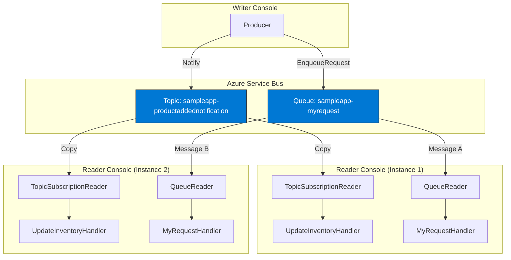

> **Topics** deliver a copy to every subscription (fan-out).
> **Queues** deliver each message to exactly one competing consumer (load balancing).

---

## 🔐 Connection String with User Secrets

For local development, store the Azure Service Bus connection string in **.NET User Secrets** — never commit it to `appsettings.json`.

### 1. Add a `UserSecretsId` in your `.csproj`

```xml
<PropertyGroup>
    <UserSecretsId>channelmediator-sample-notification-writer-console</UserSecretsId>
</PropertyGroup>
```

### 2. Set the secret

```bash
dotnet user-secrets set "ConnectionStrings:AzureBusConnectionString" "Endpoint=sb://your-namespace.servicebus.windows.net/;SharedAccessKeyName=RootManageSharedAccessKey;SharedAccessKey=YOUR_KEY"
```

The secret is stored at:
- **Windows:** `%APPDATA%\Microsoft\UserSecrets\<UserSecretsId>\secrets.json`
- **Linux/macOS:** `~/.microsoft/usersecrets/<UserSecretsId>/secrets.json`

### 3. Set `DOTNET_ENVIRONMENT=Development`

> ⚠️ **Important:** `Host.CreateDefaultBuilder` only loads user secrets when the environment is `Development`. For console apps, the default environment is `Production`, which means **user secrets are not loaded**.

Create a `Properties/launchSettings.json` in your console project:

```json
{
  "profiles": {
    "YourProjectName": {
      "commandName": "Project",
      "environmentVariables": {
        "DOTNET_ENVIRONMENT": "Development"
      }
    }
  }
}
```

### 4. Read the connection string in code

```csharp
// Both forms are equivalent:
var connectionString = context.Configuration["ConnectionStrings:AzureBusConnectionString"];
var connectionString = context.Configuration.GetConnectionString("AzureBusConnectionString");
```

---

## 📚 Related Documentation

- [🚀 ChannelMediator README](./README.md)
- [🔄 MediatR Compatibility](./MEDIATR_COMPATIBILITY.md)
- [🎭 Pipeline Behaviors](./PIPELINE_BEHAVIORS.md)
- [Azure Service Bus Documentation](https://learn.microsoft.com/azure/service-bus-messaging/)
