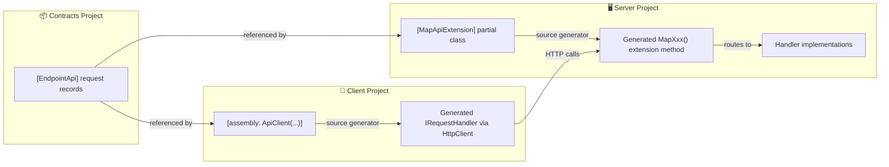
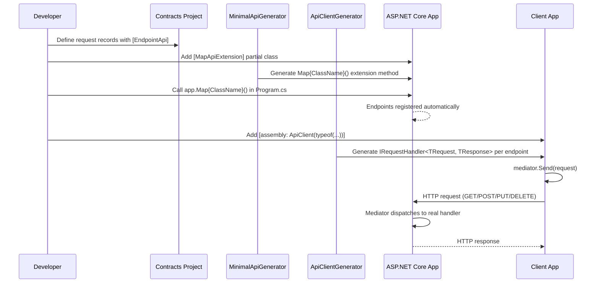
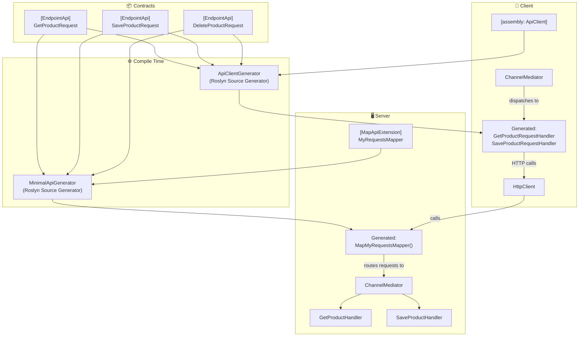
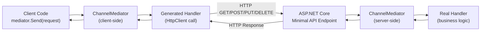

# ⚡ Minimal API & Client Generators

ChannelMediator ships three companion packages that use **Roslyn source generators** to eliminate boilerplate when building ASP.NET Core Minimal APIs and their HTTP clients.

| Package | Role |
|---|---|
| `ChannelMediator.MinimalApiGenerator.Abstraction` | Attributes (`[EndpointApi]`, `[MapApiExtension]`, `[ApiClient]`) — no generator dependency |
| `ChannelMediator.MinimalApiGenerator` | Source generator that emits Minimal API endpoint registrations on the server |
| `ChannelMediator.ApiClientGenerator` | Source generator that emits `IRequestHandler` implementations calling the server via `HttpClient` |

## Overview



## How It Works



## Installation

```bash
# Shared contracts project (attributes only, no generator)
dotnet add package ChannelMediator.MinimalApiGenerator.Abstraction

# Server project (source generator for Minimal API endpoints)
dotnet add package ChannelMediator.MinimalApiGenerator

# Client project (source generator for HttpClient handlers)
dotnet add package ChannelMediator.ApiClientGenerator
```

## Step-by-Step Guide

### 1. Create a Shared Contracts Project

This project contains your request/response records and is referenced by both server and client. It depends only on `ChannelMediator.Contracts` and `ChannelMediator.MinimalApiGenerator.Abstraction`.

```csharp
// Models/Product.cs
namespace MyApp.Contracts.Models;

public class Product
{
	public int Id { get; set; }
	public string Name { get; set; } = null!;
	public double Price { get; set; }
}
```

### 2. Decorate Requests with `[EndpointApi]`

Each request record that should be exposed as an HTTP endpoint is decorated with `[EndpointApi]`.

```csharp
// Models/GetProductRequest.cs
using ChannelMediator.MinimalApiGenerator.Abstraction;

namespace MyApp.Contracts.Models;

[EndpointApi(
	GroupName = "Catalog",
	EntityName = "products",
	UseHttpStandardVerbs = true,
	Summary = "Get a product by ID",
	Tags = new[] { "Products" })]
public record GetProductRequest(int Id) : IRequest<Product?>;
```

```csharp
// Models/SaveProductRequest.cs
[EndpointApi(
	GroupName = "Catalog",
	EntityName = "products",
	Summary = "Save a product")]
public record SaveProductRequest(Product Product) : IRequest<Product>;
```

```csharp
// Models/DeleteProductRequest.cs
[EndpointApi(
	GroupName = "Catalog",
	EntityName = "products",
	UseHttpStandardVerbs = true)]
public record DeleteProductRequest(int Id) : IRequest<bool>;
```

### 3. Set Up the Server Project

Install `ChannelMediator.MinimalApiGenerator` and reference the contracts project.

#### 3a. Create the Mapper Class

```csharp
// MapMyRequestApi.cs
using ChannelMediator.MinimalApiGenerator.Abstraction;

namespace MyApp.Server;

[MapApiExtension]
public static partial class MyRequestsMapper { }
```

The source generator fills in this partial class with a `MapMyRequestsMapper()` extension method that registers every `[EndpointApi]` request as a Minimal API endpoint.

#### 3b. Register in Program.cs

```csharp
var builder = WebApplication.CreateBuilder(args);

builder.Services.AddChannelMediator(null, typeof(Program).Assembly);
builder.Services.AddOpenApi();

var app = builder.Build();

app.MapMyRequestsMapper(); // ← all endpoints registered!

await app.RunAsync();
```

#### 3c. Implement Handlers (server-side)

```csharp
// Handlers/GetProductHandler.cs
namespace MyApp.Server.Handlers;

public class GetProductHandler : IRequestHandler<GetProductRequest, Product?>
{
	public Task<Product?> Handle(GetProductRequest request, CancellationToken cancellationToken)
	{
		// Your business logic here
		var product = new Product { Id = request.Id, Name = "Widget", Price = 9.99 };
		return Task.FromResult<Product?>(product);
	}
}
```

### 4. Set Up the Client Project

Install `ChannelMediator.ApiClientGenerator` and reference the same contracts project.

#### 4a. Add the Assembly Attribute

```csharp
// Program.cs
using ChannelMediator;
using ChannelMediator.MinimalApiGenerator.Abstraction;
using MyApp.Contracts.Models;
using Microsoft.Extensions.DependencyInjection;

[assembly: ApiClient(typeof(GetProductRequest), HttpClientName = "ApiClient")]

var services = new ServiceCollection();

services.AddChannelMediator(null, typeof(Program).Assembly);

services.AddHttpClient("ApiClient")
	.ConfigureHttpClient(cfg => cfg.BaseAddress = new Uri("https://localhost:7031/api/"));

var sp = services.BuildServiceProvider();
var mediator = sp.GetRequiredService<IMediator>();

// Use the mediator — the generated handler calls the server via HTTP
var product = await mediator.Send(new GetProductRequest(1));
Console.WriteLine(product!.Name); // "Widget"
```

The generator creates an `IRequestHandler<GetProductRequest, Product?>` that builds the correct HTTP request (GET with query string, POST with JSON body, etc.) and deserializes the response.

## Generated Code

### Server — Generated Endpoint Map

For the examples above, the generator produces an extension method similar to:

```csharp
// Auto-generated
public static partial class MyRequestsMapper
{
	public static IEndpointRouteBuilder MapMyRequestsMapper(this IEndpointRouteBuilder app)
	{
		var catalog = app.MapGroup("/api/catalog");

		catalog.MapGet("/products", async (int id, IMediator mediator, CancellationToken ct) =>
		{
			var result = await mediator.Send(new GetProductRequest(id), ct);
			return result is null ? Results.NotFound() : Results.Ok(result);
		})
		.WithSummary("Get a product by ID")
		.WithTags("Products");

		catalog.MapPost("/products", async (SaveProductRequest request, IMediator mediator, CancellationToken ct) =>
		{
			var result = await mediator.Send(request, ct);
			return Results.Ok(result);
		})
		.WithSummary("Save a product");

		catalog.MapDelete("/products", async (int id, IMediator mediator, CancellationToken ct) =>
		{
			var result = await mediator.Send(new DeleteProductRequest(id), ct);
			return Results.Ok(result);
		});

		return app;
	}
}
```

### Client — Generated Handler

For `GetProductRequest` (a GET endpoint), the generator produces:

```csharp
// Auto-generated — GetProductRequestHandler.g.cs
internal class GetProductRequestHandler : IRequestHandler<GetProductRequest, Product?>
{
	private readonly IHttpClientFactory _httpClientFactory;

	public GetProductRequestHandler(IHttpClientFactory httpClientFactory)
	{
		_httpClientFactory = httpClientFactory;
	}

	public async Task<Product?> Handle(GetProductRequest request, CancellationToken cancellationToken)
	{
		var httpClient = _httpClientFactory.CreateClient("ApiClient");
		var url = $"{httpClient.BaseAddress}catalog/products?id={request.Id}";
		var result = await httpClient.GetFromJsonAsync<Product>(url, JsonSerializerOptions.Web, cancellationToken);
		return result!;
	}
}
```

For POST/PUT requests, the body is serialized as JSON. For DELETE, query string parameters are used.

## `[EndpointApi]` Attribute Reference

| Property | Type | Default | Description |
|---|---|---|---|
| `GroupName` | `string` | `"Default"` | Route group mapped to `/api/{groupName}` (lower-cased) |
| `EntityName` | `string` | Request name minus `Request` suffix | Entity segment appended to the group prefix |
| `Tags` | `string[]` | `[]` | OpenAPI tags for Swagger UI grouping |
| `Summary` | `string?` | `null` | Short endpoint description for Swagger UI |
| `Description` | `string?` | `null` | Detailed description (supports Markdown) |
| `AuthenticationSchemes` | `string[]` | `[]` | Auth schemes; generates `.RequireAuthorization(...)` |
| `UseHttpStandardVerbs` | `bool` | `false` | Infer HTTP verb from request type name (see table below) |

### HTTP Verb Inference

When `UseHttpStandardVerbs = true`, the verb is derived from the request type name prefix:

| Prefix | HTTP Verb | Binding |
|---|---|---|
| `Get*` | GET | Query string parameters |
| `Delete*` | DELETE | Query string parameters |
| `Put*` / `Update*` | PUT | JSON body |
| `Post*` / `Create*` / `Save*` | POST | JSON body |

When `UseHttpStandardVerbs = false` (default), all endpoints use **POST** with a JSON body.

## `[MapApiExtension]` Attribute Reference

| Property | Type | Default | Description |
|---|---|---|---|
| `WithVersionning` | `bool` | `false` | Adds an `ApiVersionSet` parameter (requires `Asp.Versioning.Http`) |
| `ScanAssemblies` | `string[]?` | `null` | Assembly names to scan; `null` = scan all referenced assemblies |

## `[ApiClient]` Attribute Reference

| Property | Type | Default | Description |
|---|---|---|---|
| `ContractsAssemblyType` | `Type` | *(required)* | A type from the assembly containing the request contracts |
| `HttpClientName` | `string` | `"ApiClient"` | Named `HttpClient` to inject via `IHttpClientFactory` |

## Architecture Diagram



## Request Flow



## API Versioning Support

Enable API versioning by setting `WithVersionning = true` on the `[MapApiExtension]` attribute:

```csharp
[MapApiExtension(WithVersionning = true)]
public static partial class MyRequestsMapper { }
```

The generated extension method will accept an `ApiVersionSet` parameter:

```csharp
// Program.cs
var versionSet = app.NewApiVersionSet()
	.HasApiVersion(new ApiVersion(1))
	.HasApiVersion(new ApiVersion(2))
	.Build();

app.MapMyRequestsMapper(versionSet);
```

> Requires the `Asp.Versioning.Http` NuGet package.

## Scanning Specific Assemblies

By default, the generator scans all referenced assemblies for `[EndpointApi]` types. To restrict scanning:

```csharp
[MapApiExtension(ScanAssemblies = new[] { "MyApp.Contracts" })]
public static partial class MyRequestsMapper { }
```

## Authentication

Use the `AuthenticationSchemes` property to require authentication on an endpoint:

```csharp
[EndpointApi(
	GroupName = "Catalog",
	EntityName = "products",
	UseHttpStandardVerbs = true,
	AuthenticationSchemes = new[] { "Bearer" })]
public record GetProductRequest(int Id) : IRequest<Product?>;
```

The generator emits `.RequireAuthorization(new AuthorizeAttribute { AuthenticationSchemes = "Bearer" })` on the endpoint.

## Error Handling (Client)

The generated client handlers throw a `ClientApiException` (auto-generated) when the server returns a non-success status code:

```csharp
try
{
	var product = await mediator.Send(new SaveProductRequest(myProduct));
}
catch (ClientApiException ex)
{
	Console.WriteLine($"API error: {ex.Response.StatusCode}");
}
```

## Full Example Project Structure

```
MyApp/
├── MyApp.Contracts/                          # Shared contracts
│   ├── Models/
│   │   ├── Product.cs
│   │   ├── GetProductRequest.cs              # [EndpointApi]
│   │   ├── SaveProductRequest.cs             # [EndpointApi]
│   │   └── DeleteProductRequest.cs           # [EndpointApi]
│   └── MyApp.Contracts.csproj
│       → ChannelMediator.Contracts
│       → ChannelMediator.MinimalApiGenerator.Abstraction
│
├── MyApp.Server/                             # ASP.NET Core API
│   ├── Handlers/
│   │   ├── GetProductHandler.cs
│   │   ├── SaveProductHandler.cs
│   │   └── DeleteProductHandler.cs
│   ├── MapMyRequestApi.cs                    # [MapApiExtension]
│   ├── Program.cs                            # app.MapMyRequestsMapper()
│   └── MyApp.Server.csproj
│       → ChannelMediator
│       → ChannelMediator.MinimalApiGenerator  (source generator)
│       → MyApp.Contracts
│
└── MyApp.Client/                             # Console / Blazor / etc.
	├── Program.cs                            # [assembly: ApiClient(...)]
	└── MyApp.Client.csproj
		→ ChannelMediator
		→ ChannelMediator.ApiClientGenerator   (source generator)
		→ MyApp.Contracts
```
