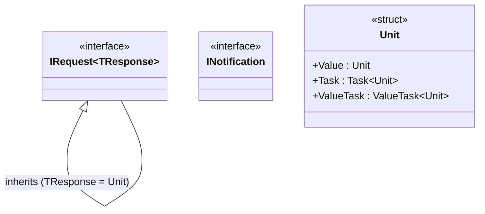
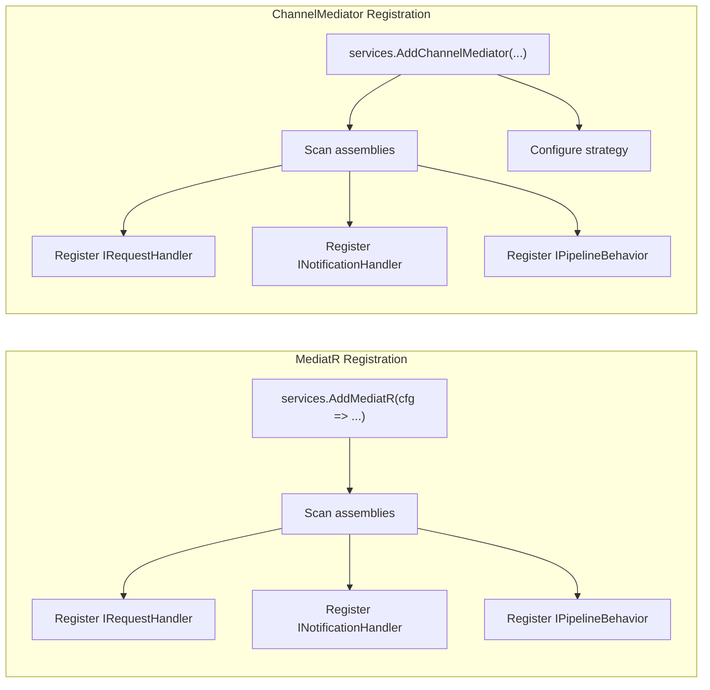
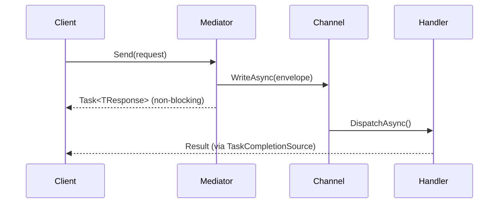
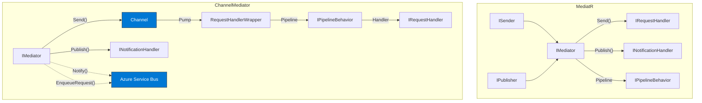

# 🔄 MediatR Compatibility

**ChannelMediator** is designed as a **drop-in replacement** for MediatR. If you already use MediatR, migrating is straightforward — the interfaces, patterns, and registration model are intentionally aligned.

## Table of Contents

- [Compatibility Overview](#-compatibility-overview)
- [Interface Mapping](#-interface-mapping)
- [Requests and Handlers](#-requests-and-handlers)
- [Commands (Void Requests)](#-commands-void-requests)
- [Notifications](#-notifications)
- [Pipeline Behaviors](#-pipeline-behaviors)
- [Registration](#-registration)
- [Runtime Dispatch](#-runtime-dispatch-send--publish-with-object)
- [Key Differences](#-key-differences)
- [Migration Guide](#-migration-guide)
- [Side-by-Side Comparison](#-side-by-side-comparison)

---

## ✅ Compatibility Overview

| Feature | MediatR | ChannelMediator | Status |
|---------|---------|-----------------|--------|
| `IRequest<TResponse>` | ✅ | ✅ | Identical signature |
| `IRequest` (void/command) | ✅ | ✅ | Identical signature |
| `INotification` | ✅ | ✅ | Identical signature |
| `IRequestHandler<TRequest, TResponse>` | ✅ | ✅ | Identical signature |
| `IRequestHandler<TRequest>` (command) | ✅ | ✅ | Identical signature |
| `INotificationHandler<TNotification>` | ✅ | ✅ | Identical signature |
| `IMediator.Send<TResponse>()` | ✅ | ✅ | Identical signature |
| `IMediator.Send()` (command) | ✅ | ✅ | Identical signature |
| `IMediator.Send(object)` | ✅ | ✅ | Identical signature |
| `IMediator.Publish<T>()` | ✅ | ✅ | Identical signature |
| `IMediator.Publish(object)` | ✅ | ✅ | Identical signature |
| `IPipelineBehavior<TRequest, TResponse>` | ✅ | ✅ | `ValueTask` return |
| `Unit` | ✅ | ✅ | Identical struct |
| Assembly scanning registration | ✅ | ✅ | Identical pattern |
| `ISender` / `IPublisher` split | ✅ | ❌ | Single `IMediator` |
| `IStreamRequestHandler<>` | ✅ | ❌ | Not supported |
| `INotificationPublisher` customization | ✅ | ⚡ | Built-in strategy |

---

## 🔗 Interface Mapping

### Contracts (namespace: `ChannelMediator`)



| MediatR | ChannelMediator | Notes |
|---------|-----------------|-------|
| `MediatR.IRequest<TResponse>` | `ChannelMediator.IRequest<TResponse>` | Same signature |
| `MediatR.IRequest` | `ChannelMediator.IRequest` | Inherits `IRequest<Unit>` |
| `MediatR.INotification` | `ChannelMediator.INotification` | Same marker interface |
| `MediatR.Unit` | `ChannelMediator.Unit` | Same struct with `Value`, `Task`, `ValueTask` |

### Handlers (namespace: `ChannelMediator`)

| MediatR | ChannelMediator | Notes |
|---------|-----------------|-------|
| `IRequestHandler<TRequest, TResponse>` | `IRequestHandler<TRequest, TResponse>` | Same `Handle(TRequest, CancellationToken)` |
| `IRequestHandler<TRequest>` | `IRequestHandler<TRequest>` | Same `Handle(TRequest, CancellationToken)` |
| `INotificationHandler<T>` | `INotificationHandler<T>` | Same `Handle(T, CancellationToken)` |

---

## 📨 Requests and Handlers

### MediatR

```csharp
using MediatR;

public record GetOrderQuery(int OrderId) : IRequest<OrderDto>;

public class GetOrderHandler : IRequestHandler<GetOrderQuery, OrderDto>
{
    public async Task<OrderDto> Handle(GetOrderQuery request, CancellationToken cancellationToken)
    {
        return new OrderDto(request.OrderId, "Shipped");
    }
}
```

### ChannelMediator

```csharp
using ChannelMediator;

// Identical code — just change the using statement
public record GetOrderQuery(int OrderId) : IRequest<OrderDto>;

public class GetOrderHandler : IRequestHandler<GetOrderQuery, OrderDto>
{
    public async Task<OrderDto> Handle(GetOrderQuery request, CancellationToken cancellationToken)
    {
        return new OrderDto(request.OrderId, "Shipped");
    }
}
```

### Usage

```csharp
// MediatR
var order = await mediator.Send(new GetOrderQuery(42));

// ChannelMediator — identical
var order = await mediator.Send(new GetOrderQuery(42));
```

---

## 📝 Commands (Void Requests)

Commands that don't return a value use `IRequest` (which inherits from `IRequest<Unit>` internally).

### MediatR

```csharp
using MediatR;

public record DeleteOrderCommand(int OrderId) : IRequest;

public class DeleteOrderHandler : IRequestHandler<DeleteOrderCommand>
{
    public Task Handle(DeleteOrderCommand request, CancellationToken cancellationToken)
    {
        Console.WriteLine($"Deleted order {request.OrderId}");
        return Task.CompletedTask;
    }
}
```

### ChannelMediator

```csharp
using ChannelMediator;

// Identical code
public record DeleteOrderCommand(int OrderId) : IRequest;

public class DeleteOrderHandler : IRequestHandler<DeleteOrderCommand>
{
    public Task Handle(DeleteOrderCommand request, CancellationToken cancellationToken)
    {
        Console.WriteLine($"Deleted order {request.OrderId}");
        return Task.CompletedTask;
    }
}
```

### Usage

```csharp
// Both — identical
await mediator.Send(new DeleteOrderCommand(42));
```

---

## 🔔 Notifications

Multiple handlers can subscribe to a single notification. Both frameworks support this identically.

### MediatR

```csharp
using MediatR;

public record OrderShippedEvent(int OrderId) : INotification;

public class SendEmailHandler : INotificationHandler<OrderShippedEvent>
{
    public Task Handle(OrderShippedEvent notification, CancellationToken ct)
    {
        Console.WriteLine($"Email sent for order {notification.OrderId}");
        return Task.CompletedTask;
    }
}

public class UpdateDashboardHandler : INotificationHandler<OrderShippedEvent>
{
    public Task Handle(OrderShippedEvent notification, CancellationToken ct)
    {
        Console.WriteLine($"Dashboard updated for order {notification.OrderId}");
        return Task.CompletedTask;
    }
}
```

### ChannelMediator

```csharp
using ChannelMediator;

// Identical code
public record OrderShippedEvent(int OrderId) : INotification;

public class SendEmailHandler : INotificationHandler<OrderShippedEvent>
{
    public Task Handle(OrderShippedEvent notification, CancellationToken ct)
    {
        Console.WriteLine($"Email sent for order {notification.OrderId}");
        return Task.CompletedTask;
    }
}

public class UpdateDashboardHandler : INotificationHandler<OrderShippedEvent>
{
    public Task Handle(OrderShippedEvent notification, CancellationToken ct)
    {
        Console.WriteLine($"Dashboard updated for order {notification.OrderId}");
        return Task.CompletedTask;
    }
}
```

### Usage

```csharp
// Both — identical
await mediator.Publish(new OrderShippedEvent(42));
```

### Notification Strategy

MediatR dispatches notifications sequentially by default and requires a custom `INotificationPublisher` for parallel dispatch. ChannelMediator provides this as a built-in configuration option:

```csharp
// ChannelMediator — built-in parallel support
services.AddChannelMediator(config =>
    config.Strategy = NotificationPublishStrategy.Parallel);
```

---

## 🎭 Pipeline Behaviors

Pipeline behaviors wrap handler execution, enabling cross-cutting concerns like logging, validation, and performance monitoring.

### MediatR

```csharp
using MediatR;

public class LoggingBehavior<TRequest, TResponse>
    : IPipelineBehavior<TRequest, TResponse>
    where TRequest : IRequest<TResponse>
{
    public async Task<TResponse> Handle(
        TRequest request,
        RequestHandlerDelegate<TResponse> next,
        CancellationToken cancellationToken)
    {
        Console.WriteLine($"Before: {typeof(TRequest).Name}");
        var response = await next();
        Console.WriteLine($"After: {typeof(TRequest).Name}");
        return response;
    }
}
```

### ChannelMediator

```csharp
using ChannelMediator;

public class LoggingBehavior<TRequest, TResponse>
    : IPipelineBehavior<TRequest, TResponse>, IPipelineBehavior  // ← marker for global
    where TRequest : IRequest<TResponse>
{
    public async ValueTask<TResponse> HandleAsync(          // ← ValueTask + HandleAsync
        TRequest request,
        RequestHandlerDelegate<TResponse> next,
        CancellationToken cancellationToken)
    {
        Console.WriteLine($"Before: {typeof(TRequest).Name}");
        var response = await next();
        Console.WriteLine($"After: {typeof(TRequest).Name}");
        return response;
    }
}
```

### Differences in Pipeline Behaviors

| Aspect | MediatR | ChannelMediator |
|--------|---------|-----------------|
| Method name | `Handle` | `HandleAsync` |
| Return type | `Task<TResponse>` | `ValueTask<TResponse>` |
| Global marker | All behaviors are global by default | Add `IPipelineBehavior` marker interface for global scope |
| Specific behaviors | Not built-in (use type constraints) | First-class `AddPipelineBehavior<TReq, TRes, TBehavior>()` |

### Global vs. Specific Behaviors

ChannelMediator distinguishes between **global** behaviors (applied to all requests) and **specific** behaviors (applied to a single request type):

```csharp
// Global — applies to ALL requests
// Behavior must implement both IPipelineBehavior<,> AND the marker IPipelineBehavior
services.AddOpenPipelineBehavior(typeof(LoggingBehavior<,>));

// Specific — applies only to AddToCartRequest
services.AddPipelineBehavior<AddToCartRequest, CartItem, ValidationBehavior<AddToCartRequest, CartItem>>();
```

---

## 📦 Registration

### MediatR

```csharp
using MediatR;

services.AddMediatR(cfg =>
    cfg.RegisterServicesFromAssembly(Assembly.GetExecutingAssembly()));
```

### ChannelMediator

```csharp
using ChannelMediator;

services.AddChannelMediator(
    config => config.Strategy = NotificationPublishStrategy.Parallel,
    Assembly.GetExecutingAssembly());
```

Both use **assembly scanning** to automatically discover and register all handlers. The registration call is the only line that changes during migration.



---

## 🔀 Runtime Dispatch (Send / Publish with `object`)

Both frameworks support dispatching requests and notifications when the type is only known at runtime:

```csharp
object request = new GetOrderQuery(42);

// MediatR
var result = await mediator.Send(request);

// ChannelMediator — identical
var result = await mediator.Send(request);
```

```csharp
object notification = new OrderShippedEvent(42);

// MediatR
await mediator.Publish(notification);

// ChannelMediator — identical
await mediator.Publish(notification);
```

ChannelMediator optimizes runtime dispatch by pre-computing a type cache at startup, avoiding per-call reflection overhead.

---

## ⚡ Key Differences

### 1. Channel-Based Processing

ChannelMediator routes all requests through a `System.Threading.Channels.Channel<T>`, providing natural backpressure and non-blocking dispatch:



MediatR invokes handlers directly in the calling thread. ChannelMediator enqueues requests into a channel and processes them via a background pump.

### 2. Pipeline Behavior Return Type

| | MediatR | ChannelMediator |
|---|---------|-----------------|
| **Return type** | `Task<TResponse>` | `ValueTask<TResponse>` |
| **Method name** | `Handle` | `HandleAsync` |

`ValueTask<TResponse>` avoids heap allocations when the result is available synchronously, improving performance in high-throughput pipelines.

### 3. Global Behavior Marker

MediatR registers all open-generic behaviors as global by default. ChannelMediator requires the `IPipelineBehavior` marker interface to explicitly mark a behavior as global:

```csharp
// ChannelMediator: global behavior requires the marker
public class MyBehavior<TRequest, TResponse>
    : IPipelineBehavior<TRequest, TResponse>, IPipelineBehavior  // ← marker
    where TRequest : IRequest<TResponse>
{ ... }
```

### 4. Notification Strategy

| | MediatR | ChannelMediator |
|---|---------|-----------------|
| **Sequential** | Default | `NotificationPublishStrategy.Sequential` |
| **Parallel** | Custom `INotificationPublisher` | `NotificationPublishStrategy.Parallel` |

### 5. IMediator Interface

MediatR splits `IMediator` into `ISender` and `IPublisher`. ChannelMediator uses a single `IMediator` interface:

```csharp
// MediatR
public interface IMediator : ISender, IPublisher { }

// ChannelMediator
public interface IMediator
{
    Task<TResponse> Send<TResponse>(IRequest<TResponse> request, CancellationToken ct = default);
    Task Send(IRequest request, CancellationToken ct = default);
    Task<object?> Send(object request, CancellationToken ct = default);
    Task Publish<TNotification>(TNotification notification, CancellationToken ct = default)
        where TNotification : INotification;
    Task Publish(object notification, CancellationToken ct = default);
}
```

### 6. Azure Service Bus Extension

ChannelMediator provides a built-in extension for distributed messaging via Azure Service Bus, which MediatR does not offer:

```csharp
// Distributed notification (via Azure Service Bus topic)
await mediator.Notify(new OrderShippedEvent(42));

// Distributed request (via Azure Service Bus queue)
await mediator.EnqueueRequest(new ProcessOrderCommand(42));
```

👉 See [Azure Service Bus Integration](./AZURE_SERVICE_BUS.md)

---

## 🚀 Migration Guide

### Step 1 — Replace NuGet Package

```diff
- <PackageReference Include="MediatR" Version="12.*" />
+ <ProjectReference Include="..\ChannelMediator\ChannelMediator.csproj" />
```

### Step 2 — Replace Namespace

```diff
- using MediatR;
+ using ChannelMediator;
```

### Step 3 — Replace Registration

```diff
- services.AddMediatR(cfg =>
-     cfg.RegisterServicesFromAssembly(Assembly.GetExecutingAssembly()));
+ services.AddChannelMediator(
+     config => config.Strategy = NotificationPublishStrategy.Sequential,
+     Assembly.GetExecutingAssembly());
```

### Step 4 — Update Pipeline Behaviors

```diff
  public class LoggingBehavior<TRequest, TResponse>
-     : IPipelineBehavior<TRequest, TResponse>
+     : IPipelineBehavior<TRequest, TResponse>, IPipelineBehavior
      where TRequest : IRequest<TResponse>
  {
-     public async Task<TResponse> Handle(
+     public async ValueTask<TResponse> HandleAsync(
          TRequest request,
          RequestHandlerDelegate<TResponse> next,
          CancellationToken cancellationToken)
      {
          // ... unchanged logic ...
      }
  }
```

```diff
- services.AddScoped(typeof(IPipelineBehavior<,>), typeof(LoggingBehavior<,>));
+ services.AddOpenPipelineBehavior(typeof(LoggingBehavior<,>));
```

### Step 5 — Verify

No changes required for:
- ✅ `IRequest<TResponse>` / `IRequest` definitions
- ✅ `INotification` definitions
- ✅ `IRequestHandler<TRequest, TResponse>` implementations
- ✅ `IRequestHandler<TRequest>` implementations
- ✅ `INotificationHandler<TNotification>` implementations
- ✅ `mediator.Send(...)` call sites
- ✅ `mediator.Publish(...)` call sites
- ✅ `Unit` usage

---

## 📊 Side-by-Side Comparison



| Aspect | MediatR | ChannelMediator |
|--------|---------|-----------------|
| **Processing model** | Direct invocation | Channel-based with background pump |
| **Backpressure** | None | Built-in via `System.Threading.Channels` |
| **Behavior return type** | `Task<T>` | `ValueTask<T>` |
| **Global behaviors** | All open-generic by default | Explicit `IPipelineBehavior` marker |
| **Notification strategy** | Custom publisher | Built-in `Sequential` / `Parallel` |
| **Interface split** | `ISender` + `IPublisher` | Single `IMediator` |
| **Distributed messaging** | Not included | Azure Service Bus extension |
| **Target framework** | .NET Standard 2.0+ | .NET 10 |

---

## 📚 Related Documentation

- [🚀 ChannelMediator README](./README.md)
- [🚌 Azure Service Bus Integration](./AZURE_SERVICE_BUS.md)
- [🎭 Pipeline Behaviors](./PIPELINE_BEHAVIORS.md)
- [📊 Sequence Diagram](./SEQUENCE_DIAGRAM.md)
