# 🐇 ChannelMediator.RabbitMQ

**Distributed messaging extension for ChannelMediator using RabbitMQ.**

## Table of Contents

- [Why Distributed Messaging?](#-why-distributed-messaging)
- [How It Works](#-how-it-works)
- [Installation](#-installation)
- [Configuration](#-configuration)
  - [Live Mode](#live-mode-rabbitmq-broker)
  - [Mock Mode](#mock-mode-local-development)
- [Publishing Notifications (Exchanges)](#-publishing-notifications-exchanges)
- [Enqueuing Requests (Queues)](#-enqueuing-requests-queues)
- [Reading Notifications (Exchange Subscriptions)](#-reading-notifications-exchange-subscriptions)
- [Reading Requests (Queue Consumers)](#-reading-requests-queue-consumers)
- [Scaling with Competing Consumers](#-scaling-with-competing-consumers)
- [Entity Auto-Creation](#-entity-auto-creation)
- [Fire-and-Forget Semantics](#-fire-and-forget-semantics)
- [Full Architecture](#-full-architecture)
- [Configuration Reference](#-configuration-reference)
- [End-to-End Example](#-end-to-end-example)
- [Comparison with Azure Service Bus](#-comparison-with-azure-service-bus)

---

## 🌐 Why Distributed Messaging?

In a monolithic application, a mediator dispatches requests and notifications in-process — the producer and consumer live in the same deployment. This works well, but it breaks down when you need to **scale independently**, **distribute workloads**, or **decouple services**.

### The Microservice Challenge

In a microservice environment, services must communicate across process boundaries. A single instance handling all requests quickly becomes a bottleneck:

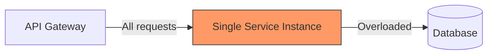

What you actually need is the ability to **distribute work across multiple consumers** so that each service instance processes a subset of the load:

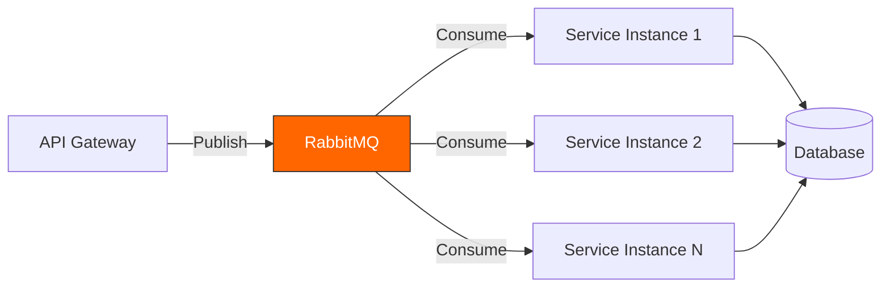

### Key Benefits

| Benefit | Description |
|---------|-------------|
| **Horizontal Scaling** | Add more consumer instances to handle increased load |
| **Decoupling** | Producers and consumers are independent — deploy, scale, and fail separately |
| **Resilience** | Messages are persisted in the broker — if a consumer crashes, the message is not lost |
| **Backpressure** | The broker absorbs traffic spikes; consumers process at their own pace |
| **Event-Driven** | Notifications fan out to multiple subscribers without the publisher knowing about them |
| **Self-Hosted** | No cloud dependency — run locally, on-premise, or in any environment |

### ChannelMediator.RabbitMQ bridges the gap

`ChannelMediator.RabbitMQ` extends the familiar `IMediator` API with two extension methods that transparently route messages through **RabbitMQ** instead of in-process channels:

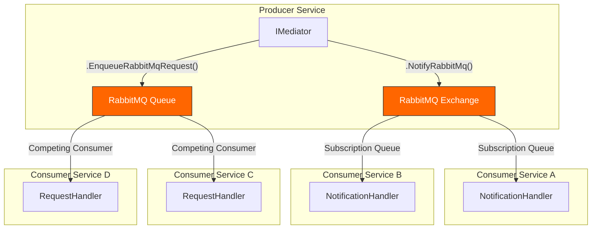

- **Exchanges** (fanout) → Fan-out delivery: every bound subscription queue receives a copy (notifications)
- **Queues** → Competing consumers: only one consumer processes each message (requests/commands)

---

## ⚙️ How It Works

### Message Flow Overview

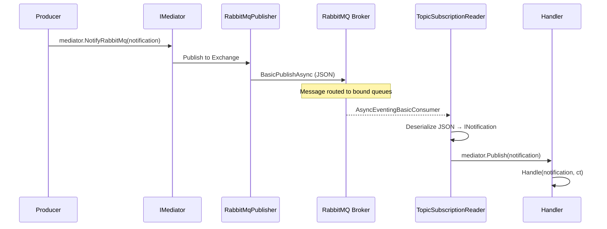

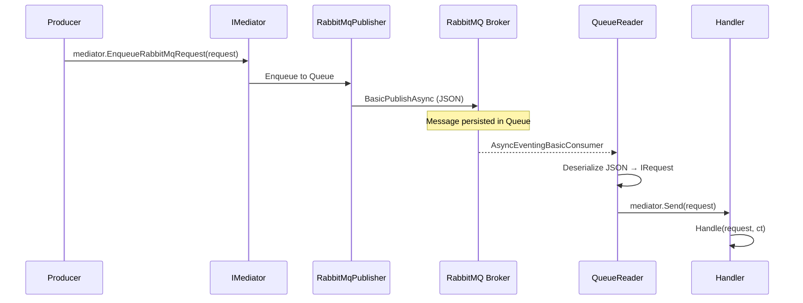

### RabbitMQ Concepts Mapping

| ChannelMediator Concept | RabbitMQ Entity | Description |
|-------------------------|-----------------|-------------|
| Notification (fan-out) | **Fanout Exchange** + bound queues | Each subscriber gets its own queue bound to the exchange |
| Request (competing) | **Queue** (default exchange) | Messages published directly to the queue via default exchange |
| Subscription queue name | `{exchange}.{subscriberName}` | Convention: exchange name + dot + subscriber name |

### Naming Convention

All exchange and queue names are automatically built using the configured prefix and the type name:

```
{prefix}-{typeName}
```

For example, with `Prefix = "myapp"`:
- `ProductAddedNotification` → exchange: `myapp-productaddednotification`
- `MyRequest` → queue: `myapp-myrequest`

Names are lowercased and normalized (double dots removed, trimmed). Default prefix is `chmr` if none is provided.

---

## 📦 Installation

```bash
dotnet add package ChannelMediator.RabbitMQ
```

Or via project reference:

```xml
<ProjectReference Include="..\ChannelMediator.RabbitMQ\ChannelMediator.RabbitMQ.csproj" />
```

**Dependencies:**
- `ChannelMediator`
- `RabbitMQ.Client` (7.x — async-first API)
- `Microsoft.Extensions.Hosting.Abstractions`

---

## 🔧 Configuration

### Live Mode (RabbitMQ Broker)

```csharp
using ChannelMediator;
using ChannelMediator.RabbitMQ;

var host = Host.CreateDefaultBuilder(args)
    .ConfigureServices((context, services) =>
    {
        services.AddChannelMediator(config =>
        {
            config.Strategy = NotificationPublishStrategy.Parallel;

            config.UseChannelMediatorRabbitMQ(opts =>
            {
                opts.Prefix = "myapp";
                opts.HostName = "localhost";
                opts.Port = 5672;
                opts.UserName = "guest";
                opts.Password = "guest";
                opts.VirtualHost = "/";
                opts.ProcessMode = RabbitMqMode.Live;
                opts.TopicSubscriberName = "order-service";
            });

        }, Assembly.GetExecutingAssembly());
    })
    .Build();
```

### Mock Mode (Local Development)

In mock mode, no RabbitMQ broker connection is needed. Messages are processed **in-process** through the local mediator, making it ideal for development and testing:

```csharp
config.UseChannelMediatorRabbitMQ(opts =>
{
    opts.Prefix = "myapp";
    opts.ProcessMode = RabbitMqMode.Mock;
});
```

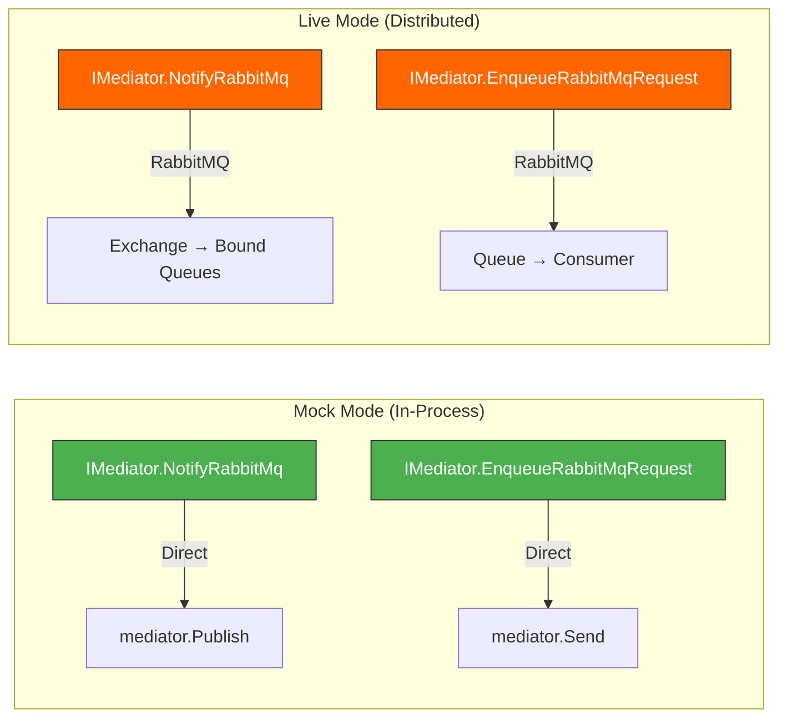

---

## 📢 Publishing Notifications (Exchanges)

Notifications use the **publish-subscribe** pattern via RabbitMQ **Fanout Exchanges**. Every bound subscription queue receives a copy of the message.

### 1. Define a shared notification

```csharp
// In a shared library referenced by both producer and consumer
public record ProductAddedNotification(string ProductCode, int Quantity, decimal Total)
    : INotification;
```

### 2. Publish from the producer

```csharp
var mediator = app.Services.GetRequiredService<IMediator>();

// Sends to RabbitMQ fanout exchange "myapp-productaddednotification"
await mediator.NotifyRabbitMq(new ProductAddedNotification("SKU-001", 5, 49.95m));
```

### 3. Subscribe from the consumer

```csharp
config.UseChannelMediatorRabbitMQ(opts =>
{
    opts.Prefix = "myapp";
    opts.HostName = "localhost";
    opts.TopicSubscriberName = "inventory-service";

    // Register a reader for this notification type
    opts.AddRabbitMqTopicNotificationReader<ProductAddedNotification>("inventory-service");
});
```

### 4. Handle the notification

```csharp
public sealed class UpdateInventoryHandler : INotificationHandler<ProductAddedNotification>
{
    public async Task Handle(ProductAddedNotification notification, CancellationToken cancellationToken)
    {
        Console.WriteLine($"[INVENTORY] Updating stock for product: {notification.ProductCode}");
        // Business logic...
    }
}
```

### Exchange Flow Diagram

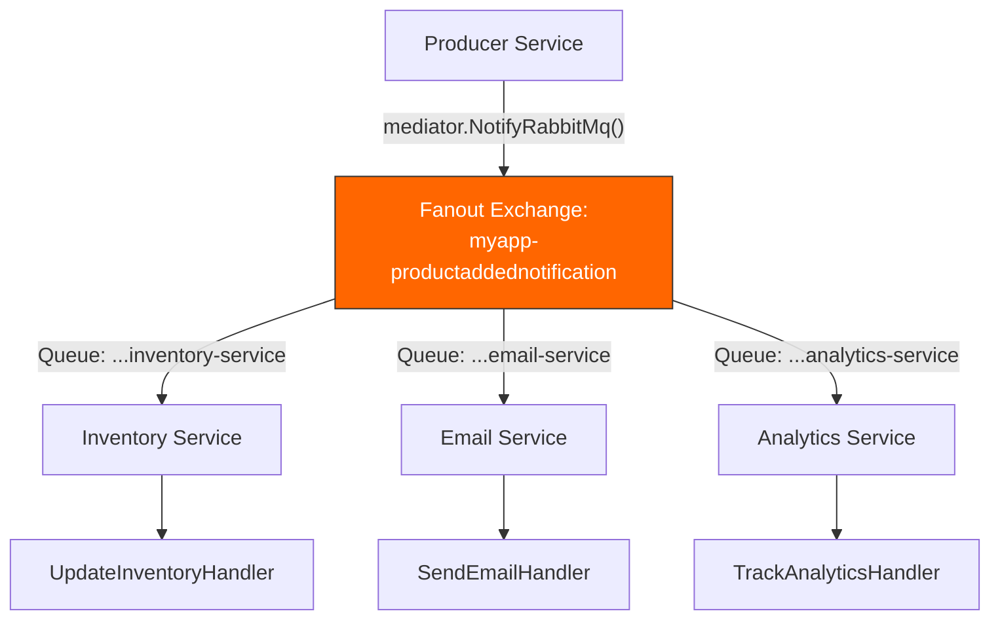

---

## 📨 Enqueuing Requests (Queues)

Requests use the **competing consumers** pattern via RabbitMQ **Queues** (published to the default exchange with the queue name as routing key). Only **one consumer** processes each message, enabling horizontal scaling.

### 1. Define a shared request

```csharp
// In a shared library
public record MyRequest(string Message) : IRequest;
```

### 2. Enqueue from the producer

```csharp
// Sends to RabbitMQ queue "myapp-myrequest"
await mediator.EnqueueRabbitMqRequest(new MyRequest("process-order-42"));
```

### 3. Register a queue reader on the consumer

```csharp
config.UseChannelMediatorRabbitMQ(opts =>
{
    opts.Prefix = "myapp";
    opts.HostName = "localhost";

    // Register a reader for this request type
    opts.AddRabbitMqQueueRequestReader<MyRequest>();
});
```

### 4. Handle the request

```csharp
internal sealed class MyRequestHandler : IRequestHandler<MyRequest>
{
    public Task Handle(MyRequest request, CancellationToken cancellationToken)
    {
        Console.WriteLine($"[REQUEST] Received: {request.Message}");
        return Task.CompletedTask;
    }
}
```

### Queue Flow Diagram

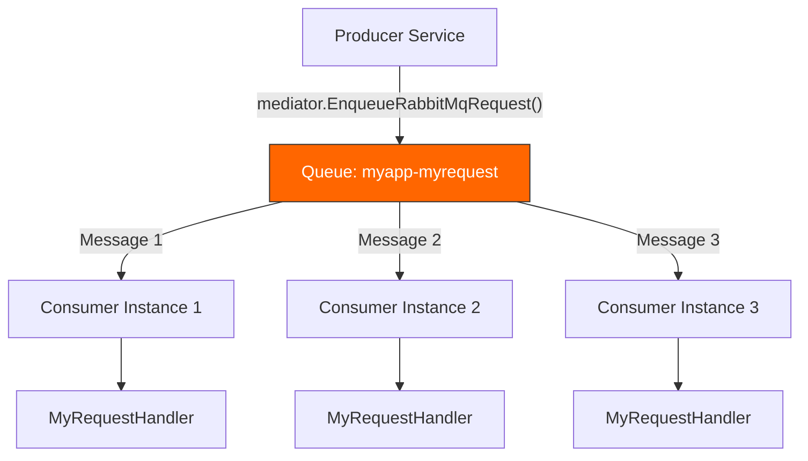

---

## 📖 Reading Notifications (Exchange Subscriptions)

### Per-Type Registration

Register a reader for a specific notification type:

```csharp
opts.AddRabbitMqTopicNotificationReader<ProductAddedNotification>("my-subscriber-name");
```

This creates:
1. A fanout exchange: `{prefix}-productaddednotification`
2. A subscription queue: `{prefix}-productaddednotification.my-subscriber-name`
3. A binding from the exchange to the queue

### Subscribe to All Exchanges (auto-discovery)

Automatically subscribe to all notification types registered in the DI container:

```csharp
opts.AddAllRabbitMqTopicNotification();
```

At startup, the `TopicSubscriptionReadersHostedService` scans all `INotificationHandler<T>` registrations in the DI container, computes the exchange name for each notification type, and creates a subscription reader. This approach works differently from Azure Service Bus (which enumerates topics on the broker) — RabbitMQ uses **DI-based discovery** since the RabbitMQ client library does not expose a management API for listing exchanges.

> **Note:** `AddAllRabbitMqTopicNotification()` requires both `TopicSubscriberName` and `Prefix` to be set. If either is empty, the call is silently ignored.

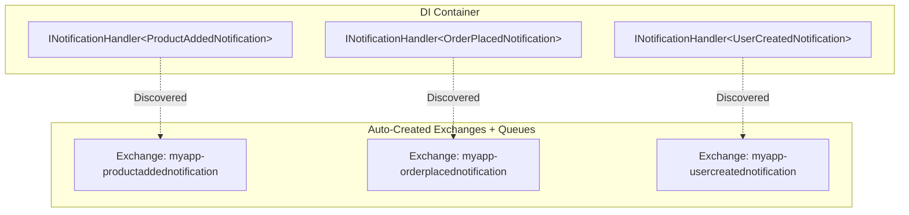

---

## 📖 Reading Requests (Queue Consumers)

### Typed Queue Reader

Reads from a queue and dispatches the deserialized request through `mediator.Send(...)`:

```csharp
opts.AddRabbitMqQueueRequestReader<MyRequest>();
```

The queue name is derived automatically from the type name and prefix.

### Custom Queue Name

Override the default queue name:

```csharp
opts.AddRabbitMqQueueRequestReader<MyRequest>(queueName: "custom-queue-name");
```

### Prefetch Tuning

Control how many messages each consumer prefetches:

```csharp
opts.AddRabbitMqQueueRequestReader<MyRequest>(configure: readerOpts =>
{
    readerOpts.PrefetchCount = 10;  // Prefetch up to 10 messages
});
```

---

## 📈 Scaling with Competing Consumers

The competing consumers pattern is the primary mechanism for horizontal scaling with queues. Each message is delivered to **exactly one** consumer instance.

### Single Instance vs. Multiple Instances

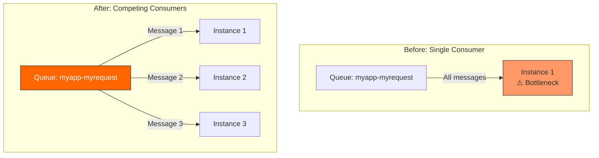

### How to Scale

Simply deploy more instances of the consumer service. Each instance registers the same queue reader:

```csharp
// Same configuration on every instance
opts.AddRabbitMqQueueRequestReader<MyRequest>();
```

RabbitMQ automatically distributes messages across connected consumers using round-robin dispatch. No code changes required — just add more instances.

### Prefetch Tuning

Control how many unacknowledged messages each consumer can receive:

```csharp
opts.AddRabbitMqQueueRequestReader<MyRequest>(configure: readerOpts =>
{
    readerOpts.PrefetchCount = 10;  // Process up to 10 messages concurrently
});
```

Or set defaults at the global level:

```csharp
config.UseChannelMediatorRabbitMQ(opts =>
{
    opts.PrefetchCount = 5;  // Default for all readers
});
```

---

## 🏗️ Entity Auto-Creation

`ChannelMediator.RabbitMQ` automatically creates RabbitMQ entities (exchanges, queues, bindings) on first use if they do not already exist.

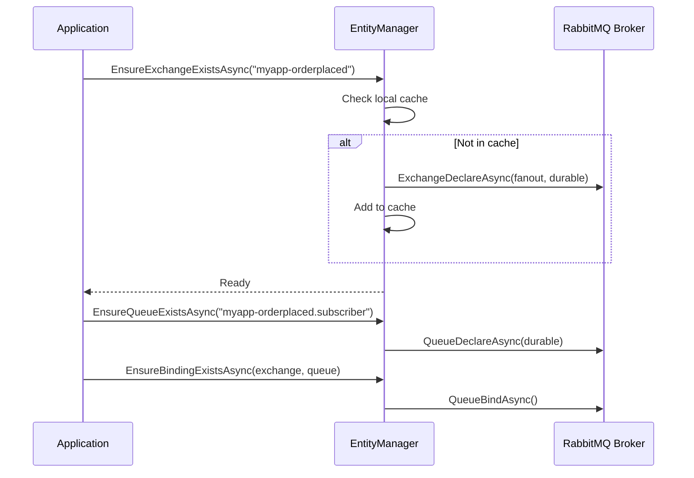

**Default entity settings:**
- **Exchanges**: Fanout, durable, non-auto-delete
- **Queues**: Durable, non-exclusive, non-auto-delete
- **Bindings**: Exchange → Queue with empty routing key (fanout)

Entity existence is cached in memory to avoid repeated declarations.

---

## 🔥 Fire-and-Forget Semantics

In **Live mode**, the `NotifyRabbitMq` and `EnqueueRabbitMqRequest` extension methods use fire-and-forget semantics. The message is dispatched to RabbitMQ via `Task.Run(...)` and the method returns immediately without awaiting the result. This maximizes throughput on the producer side.

In **Mock mode**, the methods execute synchronously through the local mediator (awaited) for predictable behavior during development and testing.

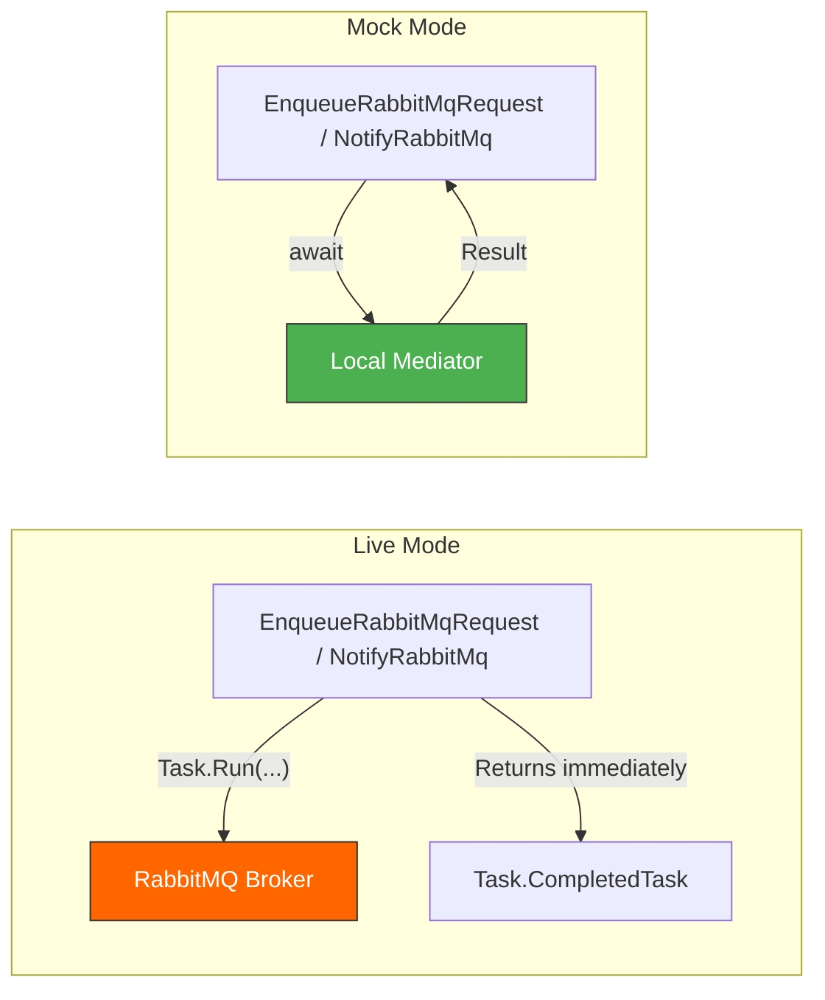

---

## 🏛️ Full Architecture

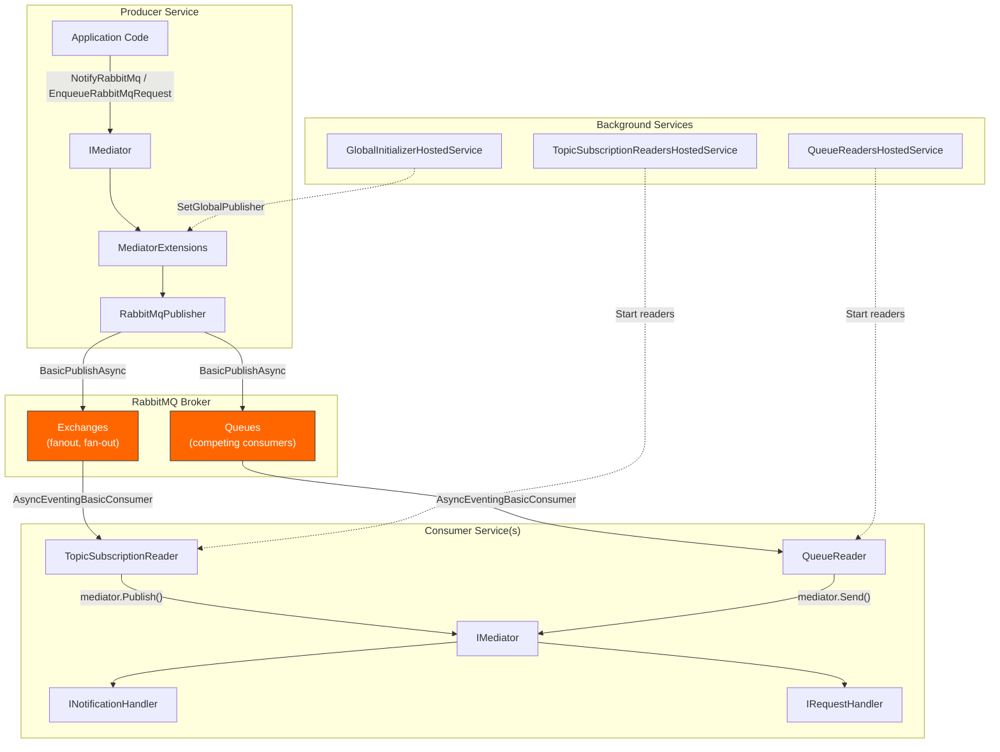

---

## 📋 Configuration Reference

### `RabbitMqOptions`

| Property | Type | Default | Description |
|----------|------|---------|-------------|
| `HostName` | `string` | `"localhost"` | RabbitMQ broker hostname |
| `Port` | `int` | `5672` | RabbitMQ broker port |
| `UserName` | `string` | `"guest"` | Authentication username |
| `Password` | `string` | `"guest"` | Authentication password |
| `VirtualHost` | `string` | `"/"` | RabbitMQ virtual host |
| `Prefix` | `string` | — | Prefix for all exchange and queue names |
| `ProcessMode` | `RabbitMqMode` | `Live` | `Live` for RabbitMQ broker, `Mock` for in-process |
| `TopicSubscriberName` | `string` | Machine name | Default subscription queue name suffix |
| `PrefetchCount` | `ushort` | `1` | Default prefetch count per consumer |
| `Strategy` | `NotificationPublishStrategy` | `Sequential` | Notification dispatch strategy (`Sequential` / `Parallel`) |

### Registration Methods

| Method | Description |
|--------|-------------|
| `AddRabbitMqTopicNotificationReader<T>(subscriptionName, configure?)` | Register a reader for a specific notification exchange |
| `AddAllRabbitMqTopicNotification()` | Subscribe to all notification types discovered via DI |
| `AddRabbitMqQueueRequestReader<T>(queueName?, configure?)` | Register a reader for a specific request queue |

### Extension Methods on `IMediator`

| Method | Description |
|--------|-------------|
| `mediator.NotifyRabbitMq<T>(notification, ct)` | Publish a notification to a RabbitMQ fanout exchange |
| `mediator.EnqueueRabbitMqRequest<R>(request, ct)` | Enqueue a request to a RabbitMQ queue |

### Message Format

Messages are serialized as **JSON** (camelCase) with the following RabbitMQ properties:
- `ContentType`: `application/json`
- `DeliveryMode`: `Persistent`
- `Type`: the type name (e.g., `ProductAddedNotification`)
- `Headers["messagetype"]`: the `AssemblyQualifiedName` (for deserialization)

---

## 🧪 End-to-End Example

### Shared Library

```csharp
// ChannelMediatorSampleShared

public record ProductAddedNotification(string ProductCode, int Quantity, decimal Total)
    : INotification;

public record MyRequest(string Message) : IRequest;
```

### Producer (Writer Console)

```csharp
var host = Host.CreateDefaultBuilder(args);

host.ConfigureServices((context, services) =>
{
    services.AddChannelMediator(config =>
    {
        config.Strategy = NotificationPublishStrategy.Parallel;

        config.UseChannelMediatorRabbitMQ(opts =>
        {
            opts.Prefix = "sampleapp";
            opts.HostName = "192.168.10.2";
            opts.Port = 5672;
            opts.UserName = "guest";
            opts.Password = "guest";
            opts.TopicSubscriberName = "my-subscriber-name";
        });

    }, Assembly.GetExecutingAssembly());
});

var app = host.Build();

await app.StartAsync();

var mediator = app.Services.GetRequiredService<IMediator>();

// Enqueue a request (delivered to exactly one consumer)
await mediator.EnqueueRabbitMqRequest(new MyRequest("enqueue-test-via-rabbitmq"));

// Publish a notification (delivered to all subscribers)
await mediator.NotifyRabbitMq(new ProductAddedNotification("p01", 10, 100));
```

### Consumer (Reader Console)

```csharp
var host = Host.CreateDefaultBuilder(args)
    .ConfigureServices((context, services) =>
    {
        services.AddChannelMediator(config =>
        {
            config.Strategy = NotificationPublishStrategy.Parallel;

            config.UseChannelMediatorRabbitMQ(opts =>
            {
                opts.Prefix = "sampleapp";
                opts.HostName = "192.168.10.2";
                opts.Port = 5672;
                opts.UserName = "guest";
                opts.Password = "guest";
                opts.TopicSubscriberName = "my-subscriber-name";

                // Read from request queue (competing consumers)
                opts.AddRabbitMqQueueRequestReader<MyRequest>();

                // Subscribe to ALL notification exchanges (auto-discovery)
                opts.AddAllRabbitMqTopicNotification();
            });

        }, Assembly.GetExecutingAssembly());

    }).Build();

await host.RunAsync();
```

### Handlers

```csharp
// Notification handler — receives copies of the notification
public sealed class UpdateInventoryHandler : INotificationHandler<ProductAddedNotification>
{
    public async Task Handle(ProductAddedNotification notification, CancellationToken cancellationToken)
    {
        await Task.Delay(30, cancellationToken);
        Console.WriteLine($"[INVENTORY] Updating stock for product: {notification.ProductCode}");
    }
}

// Request handler — processes exactly one message from the queue
internal sealed class MyRequestHandler : IRequestHandler<MyRequest>
{
    public Task Handle(MyRequest request, CancellationToken cancellationToken)
    {
        Console.WriteLine($"[REQUEST] Received: {request.Message}");
        return Task.CompletedTask;
    }
}
```

### Deployment Topology

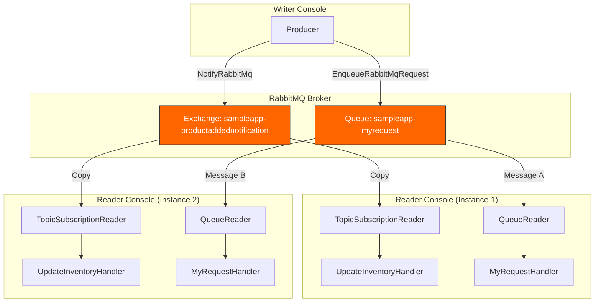

> **Exchanges** deliver a copy to every bound queue (fan-out).
> **Queues** deliver each message to exactly one competing consumer (load balancing).

---

## 🔄 Comparison with Azure Service Bus

| Feature | `ChannelMediator.AzureBus` | `ChannelMediator.RabbitMQ` |
|---------|---------------------------|---------------------------|
| **Broker** | Azure Service Bus (cloud) | RabbitMQ (self-hosted or cloud) |
| **Fan-out entity** | Topic + Subscription | Fanout Exchange + Bound Queue |
| **Competing entity** | Queue | Queue (default exchange) |
| **Extension: Notify** | `mediator.Notify()` | `mediator.NotifyRabbitMq()` |
| **Extension: Enqueue** | `mediator.EnqueueRequest()` | `mediator.EnqueueRabbitMqRequest()` |
| **Auto-discovery** | Enumerates topics via admin API | Scans DI container for `INotificationHandler<T>` |
| **Client library** | `Azure.Messaging.ServiceBus` | `RabbitMQ.Client` 7.x |
| **Mock mode** | ✅ `AzureServiceBusMode.Mock` | ✅ `RabbitMqMode.Mock` |
| **Entity auto-creation** | ✅ Topics, subscriptions, queues | ✅ Exchanges, queues, bindings |
| **Connection** | Connection string | Host + Port + User + Password |
| **Message format** | JSON (camelCase) | JSON (camelCase) |

Both integrations follow the same patterns and can coexist in the same application if needed — use Azure Service Bus for cloud workloads and RabbitMQ for on-premise or hybrid scenarios.

---

## 📚 Related Documentation

- [🚀 ChannelMediator README](./README.md)
- [🚌 Azure Service Bus Integration](./AZURE_SERVICE_BUS.md)
- [🔄 MediatR Compatibility](./MEDIATR_COMPATIBILITY.md)
- [🎭 Pipeline Behaviors](./PIPELINE_BEHAVIORS.md)
- [RabbitMQ Documentation](https://www.rabbitmq.com/docs)
