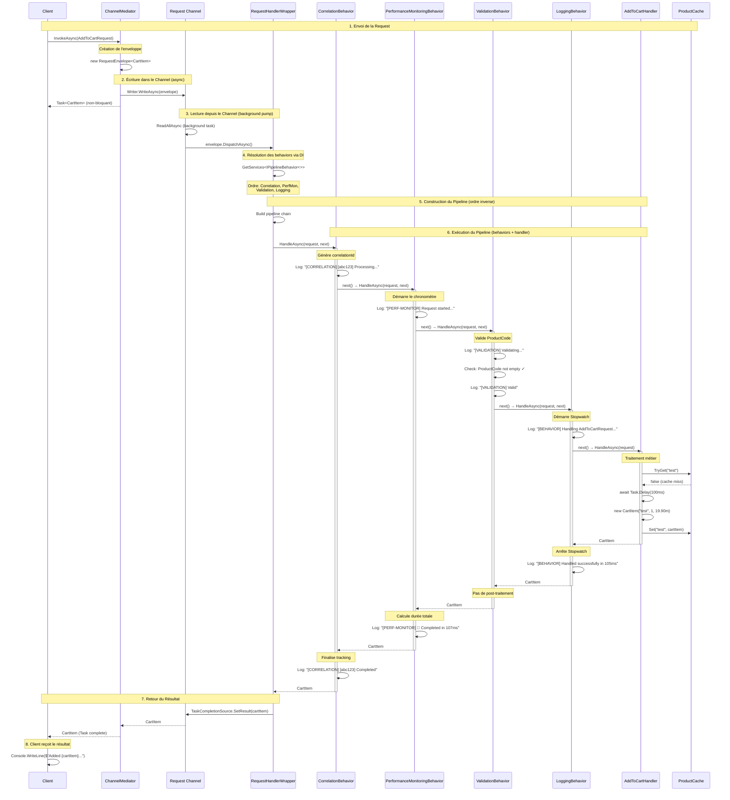
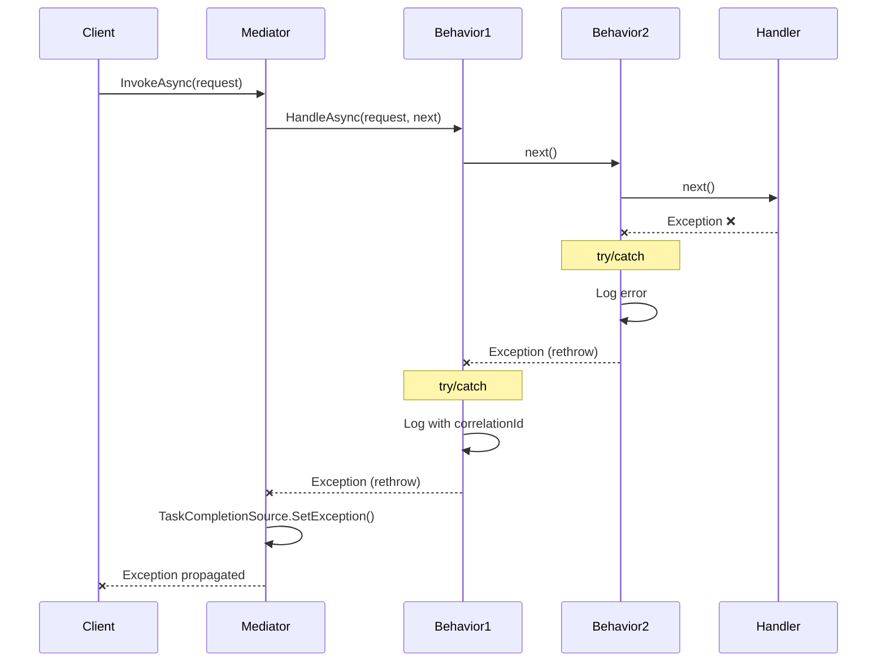

# ChannelMediator - Diagramme de Séquence

## Traitement d'une Request avec Pipeline Behaviors

Le diagramme suivant illustre le flux complet d'exécution d'une requête à travers le ChannelMediator, incluant les behaviors globaux et spécifiques.



## Légende du Diagramme

### Participants
- **Client**: L'appelant (Program.cs)
- **ChannelMediator**: Point d'entrée du médiateur
- **Request Channel**: Channel asynchrone pour le traitement en arrière-plan
- **RequestHandlerWrapper**: Wrapper qui construit et exécute le pipeline
- **Behaviors**: Les comportements dans l'ordre d'exécution
  - CorrelationBehavior (global)
  - PerformanceMonitoringBehavior (global)
  - ValidationBehavior (spécifique)
  - LoggingBehavior (spécifique)
- **AddToCartHandler**: Le handler métier final
- **ProductCache**: Service de cache

### Phases d'Exécution

#### Phase 1-2: Envoi Asynchrone
La requête est encapsulée dans une enveloppe et envoyée dans le Channel. Le client reçoit immédiatement une `Task<CartItem>` non bloquante.

#### Phase 3-4: Traitement en Arrière-Plan
Un task en arrière-plan (pump) lit le Channel et dispatche la requête. Le wrapper résout tous les behaviors via DI.

#### Phase 5: Construction du Pipeline
Les behaviors sont chaînés dans l'ordre inverse de leur enregistrement, créant un pattern décorateur.

#### Phase 6: Exécution
Le pipeline s'exécute de manière séquentielle:
1. Chaque behavior appelle `next()` pour passer au suivant
2. Le handler final traite la requête métier
3. Le résultat remonte le pipeline en ordre inverse
4. Chaque behavior peut post-traiter le résultat

#### Phase 7-8: Retour du Résultat
Le résultat est renvoyé via le `TaskCompletionSource`, complétant la `Task` du client.

## Ordre d'Exécution des Behaviors

```
Configuration (Program.cs):
┌─────────────────────────────────────────┐
│ 1. AddOpenPipelineBehavior(Correlation) │
│ 2. AddOpenPipelineBehavior(PerfMon)     │
│ 3. AddPipelineBehavior(Validation)      │
│ 4. AddPipelineBehavior(Logging)         │
└─────────────────────────────────────────┘

Exécution (ordre inverse = décorateur):
┌──────────────────────────────────────────┐
│ → Correlation (début)                    │
│   → PerfMon (début)                      │
│     → Validation (début)                 │
│       → Logging (début)                  │
│         → HANDLER                        │
│       ← Logging (fin)                    │
│     ← Validation (fin)                   │
│   ← PerfMon (fin)                        │
│ ← Correlation (fin)                      │
└──────────────────────────────────────────┘
```

## Gestion des Erreurs



## Performance et Asynchronisme

### Avantages du Channel-Based Approach
1. **Non-bloquant**: Le client reçoit immédiatement une Task
2. **Backpressure**: Le Channel gère naturellement la charge
3. **Single Reader**: Optimisation pour un lecteur unique (pump)
4. **Cancellation**: Support du CancellationToken à tous les niveaux

### Comportement Asynchrone des Behaviors
- Chaque behavior utilise `ValueTask<TResponse>`
- Les behaviors peuvent contenir du code async (`await`)
- Le pipeline complet est async de bout en bout
- Pas de blocage synchrone dans le flux

## Notes Techniques

1. **Scope DI**: Un nouveau scope est créé dans le wrapper pour chaque requête
2. **Reverse Order**: Les behaviors sont inversés (`.Reverse()`) pour l'ordre d'exécution correct
3. **Delegate Chain**: Chaque behavior capture le `next` précédent via closure
4. **Exception Handling**: Les exceptions remontent le pipeline en ordre inverse
5. **Task Completion**: Le `TaskCompletionSource` gère le retour asynchrone au client
