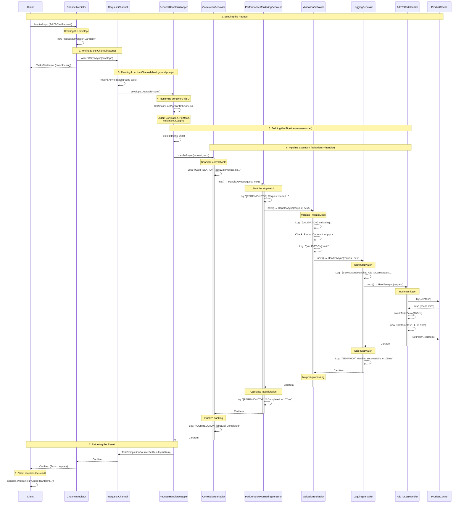
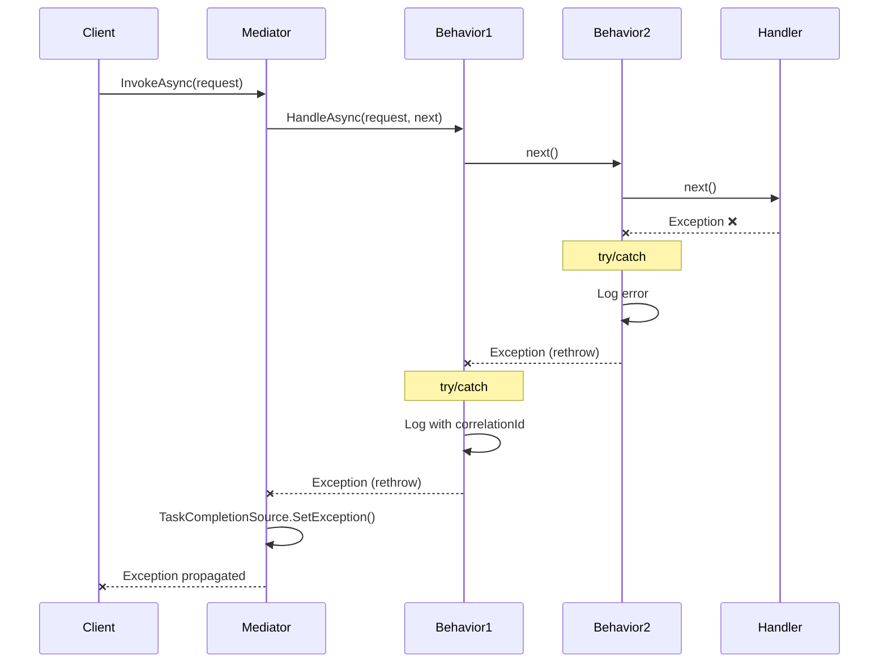

# ChannelMediator - Sequence Diagram

## Processing a Request with Pipeline Behaviors

The following diagram illustrates the complete execution flow of a request through the ChannelMediator, including global and specific behaviors.



## Diagram Legend

### Participants
- **Client**: The caller (Program.cs)
- **ChannelMediator**: Entry point of the mediator
- **Request Channel**: Asynchronous channel for background processing
- **RequestHandlerWrapper**: Wrapper that builds and executes the pipeline
- **Behaviors**: Behaviors in execution order
  - CorrelationBehavior (global)
  - PerformanceMonitoringBehavior (global)
  - ValidationBehavior (specific)
  - LoggingBehavior (specific)
- **AddToCartHandler**: The final business handler
- **ProductCache**: Cache service

### Execution Phases

#### Phase 1-2: Asynchronous Dispatch
The request is wrapped in an envelope and sent into the Channel. The client immediately receives a non-blocking `Task<CartItem>`.

#### Phase 3-4: Background Processing
A background task (pump) reads from the Channel and dispatches the request. The wrapper resolves all behaviors via DI.

#### Phase 5: Pipeline Construction
Behaviors are chained in reverse registration order, creating a decorator pattern.

#### Phase 6: Execution
The pipeline executes sequentially:
1. Each behavior calls `next()` to proceed to the next one
2. The final handler processes the business request
3. The result propagates back up the pipeline in reverse order
4. Each behavior can post-process the result

#### Phase 7-8: Result Return
The result is returned via the `TaskCompletionSource`, completing the client's `Task`.

## Behavior Execution Order

```
Configuration (Program.cs):
┌─────────────────────────────────────────┐
│ 1. AddOpenPipelineBehavior(Correlation) │
│ 2. AddOpenPipelineBehavior(PerfMon)     │
│ 3. AddPipelineBehavior(Validation)      │
│ 4. AddPipelineBehavior(Logging)         │
└─────────────────────────────────────────┘

Execution (reverse order = decorator):
┌──────────────────────────────────────────┐
│ → Correlation (start)                    │
│   → PerfMon (start)                      │
│     → Validation (start)                 │
│       → Logging (start)                  │
│         → HANDLER                        │
│       ← Logging (end)                    │
│     ← Validation (end)                   │
│   ← PerfMon (end)                        │
│ ← Correlation (end)                      │
└──────────────────────────────────────────┘
```

## Error Handling



## Performance and Asynchronism

### Advantages of the Channel-Based Approach
1. **Non-blocking**: The client immediately receives a Task
2. **Backpressure**: The Channel naturally manages load
3. **Single Reader**: Optimized for a single reader (pump)
4. **Cancellation**: CancellationToken support at every level

### Asynchronous Behavior of Behaviors
- Each behavior uses `ValueTask<TResponse>`
- Behaviors can contain async code (`await`)
- The entire pipeline is async end-to-end
- No synchronous blocking in the flow

## Technical Notes

1. **DI Scope**: A new scope is created in the wrapper for each request
2. **Reverse Order**: Behaviors are reversed (`.Reverse()`) for the correct execution order
3. **Delegate Chain**: Each behavior captures the previous `next` via closure
4. **Exception Handling**: Exceptions propagate back up the pipeline in reverse order
5. **Task Completion**: The `TaskCompletionSource` manages the asynchronous return to the client
